# PAMLA
**PAMLA** (**Predictive Agriculture Machine Learning Assistant**) is a locally-hosted, open-source agricultural forecasting AI assistant for machine learning-based [predictive agriculture](https://stories.uq.edu.au/research/2021/predicting-the-future-of-agriculture/index.html). PAMLA uses hyperlocal environmental telemetry collected from local outdoor sensor networks to forecast soil moisture on a 24-hour prediction horizon. While PAMLA's data preprocessing pipeline is designed to integrate with the home automation platform [Home Assistant](https://www.home-assistant.io) (as it expects Home Assistant-exported CSV telemetry), the general forecasting and inference architecture is platform-agnostic once data is transformed into PAMLA’s expected schema. Because the telemetry expected by the data preprocessing pipeline is a CSV file of commonplace environmental metrics, PAMLA's deployment contract could be reasonably fulfilled by non-supported systems that provide equivalent environmental data with minor data preparation. 

PAMLA uses [XGBoost](https://xgboost.ai) as its predictive modeling system and provides the ability to train the prediction engine on-demand. As a natural language inference (NLI), PAMLA's deployment interface is adaptable to various input formats that provide schema-relevant and interpretable variables and values. For example, the [PAMLA Trajectory  Shortcut](#_Shortcut) extracts schema-relevant weather forecast data from the [Apple WeatherKit API](https://developer.apple.com/weatherkit/), pre-formats it into a known-ingestible format, and returns 24 hours of hourly predictions to the user. The data can then be given to PAMLA by providing a forecast's text body to the text box on the web interface, which is then extracted by the LLM, validated as new observations using custom Pydantic modeling, and then added to the time series, where the new observation becomes immediately available for use in the inference of soil moisture at a 24-hour prediction horizon. 

FastAPI provides the ASGI-based web framework that powers PAMLA's API, which provides local network-wide accessibility to PAMLA. In a conventional deployment, PAMLA may idly ingest hourly observations as the data becomes available. At other times, the user may proactively engage the API, exploring hypothetical futures with short-term and long-term forecasts and simulations. Hypothetical futures could be unique and difficult to reconstruct as hypothetical environmental futures are modeled, while the user may go long periods of time without active API engagement. As such, PAMLA has a stateful API implementation, enabling the runtime persistence of hypothetical timeseries experiments with session-based memory. In addition to infrequent requests, a stateful API design enables PAMLA to accept short, contextual requests, such as "What if the temperature is 80 degrees?", which requires contextual reference of the evolving hypothetical timeseries. In terms of future development, a stateful API design could make MQTT data subscription and ingestion more natural. Because PAMLA is specifically designed for the modeling of hyperlocal data using locally-hosted data pipelines and infrastructure, centralized architecture can be quite ergonomic and even ideal.

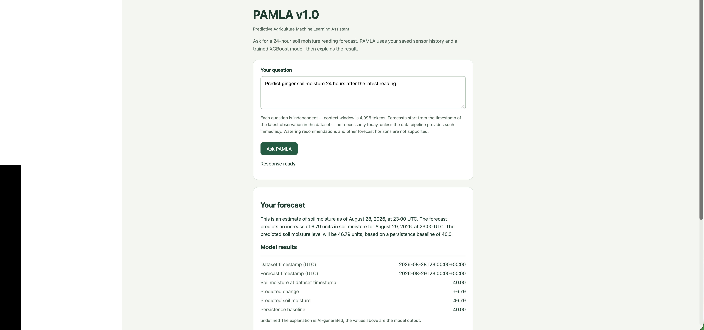
> *The PAMLA web interface is shown.*

## Table of Contents

- [Overview](#overview)
- [Architecture](#architecture)
- [Data and Feature Engineering](#data-and-feature-engineering)
- [Modeling and Experiment Tracking](#modeling-and-experiment-tracking)
- [Results](#results)
- [Setup and Installation](#setup-and-installation)
- [Running Locally](#running-locally)
- [Docker Deployment and Networking](#docker-deployment-and-networking)
- [Testing](#testing)
- [Considerations and Limitations](#considerations-and-limitations)
- [ Shortcut](#_Shortcut)
- [Future Work](#future-work)
- [Reflection](#reflection)

## Overview
This section describes the project overview as it pertains to **PAMLA's development process**. While there are many possible data pipelines and deployment configurations of PAMLA, this overview will review **PAMLA's development process**, which is one of many possible data pipeline and deployment configurations.

### Home Assistant
#### Overview
[](https://www.home-assistant.io) [**Home Assistant**](https://www.home-assistant.io) **is a locally-hosted, open-source home automation platform**. At its core, Home Assistant is a central control and intelligence hub for home automation that runs locally on your own hardware. Oriented towards local control and privacy, Home Assistant stores/process data and communicates with your devices inside of your home, keeping your information private.

Naturally, a locally-hosted home automation system requires a server. I have a small **DeskPi RackMate T1 8U 10-inch mini server rack** that hosts a mesh network access point, a power strip, and two Raspberry Pis -- one running **Homebridge** (another home automation platform), and the other running **Home Assistant**. The Home Assistant server is:
- Raspberry Pi 5
- 8 GB RAM
- 500 GB NVMe m.2 SSD
- RTL-SDR Blog V4 USB Software-Defined Radio Dongle Kit: A USB dongle with a multipurpose dipole antenna base. Included telescopic antennas extend exactly 17 cm (6.7 inches), which perfectly tunes the antenna to the 433 MHz frequency.

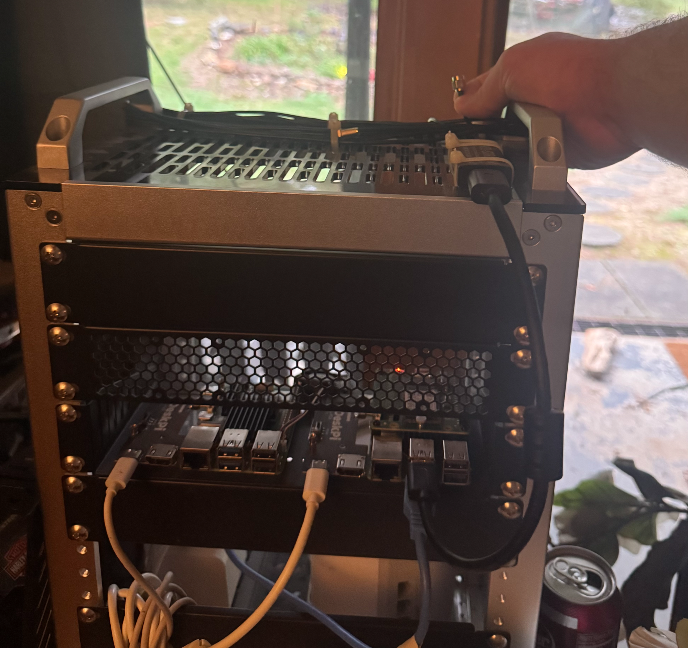

Home Assistant supports universal integration of devices. It has one of the widest selections of supported device integrations, ranging from universal standard protocols like UPnP, Matter, Zigbee, Z-Wave, and Thread to major brand-supported official integrations like Apple HomeKit, Google Home, and Amazon Alexa, and even IoT-tinkerer microcontroller-based protocols like the ESP-32-based ESPHome standard. Home Assistant has a massive development community with many repos that produce countless homebrew integrations, automations, dashboards, and other software for the community. **It also leverages classic Linux tools in new ways.**

#### `rtl-haos` and `rtl_433`
**Which brings us to the next piece of the data pipeline.**
As a Linux-based home automation platform, many popular Home Assistant packages are based on classic Linux tools. One example is [rtl-haos](https://github.com/jaronmcd/rtl-haos), a Home Assistant add-on that is designed to be a "drop-in bridge" for the [rtl_433](https://github.com/merbanan/rtl_433) command-line interface. 

`rtl_433` is a command-line tool that -- when paired with a compatible software-defined radio antenna (often via USB) -- converts radio frequency signals into plain text, KV pairs, JSON data, MQTT, logging events on a remote logger, and so on.  Using analog-to-digital conversion and demodulation, analog signals are converted into digital pulses, which are then ran through 380+ known protocol decoders to recognize signatures for devices like TPMS sensors, garage door systems, security systems, **weather stations**, **soil moisture sensors**, and more. Once identified, the output is sent to the output location and format specified, or the default if not specified.

As previously mentioned, [rtl_haos](https://www.rtl-sdr.com/rtl_haos-an-rtl_433-to-home-assistant-bridge/) is a Home Assistant add-on that acts as a drop-in bridge to seamlessly connect `rtl_433`/RF-frequency software-defined radio devices to Home Assistant. It does so by running the `rtl_433` command-line tool on Home Assistant itself, implementing the Home Assistant add-on that manages the tool (watchdog, memory management, etc.), and finally, taking the output from `rtl_433` and ingesting it into Home Assistant. It automatically creating Home Assistant entities for newly detected devices and logs the data as it would any other newly added device.

Below, you can see the log as it traces `rtl_haos`'s execution from the serial bus to identifying the USB antenna, to launching `rtl_433`, to defining JSON as the output, and monitoring the processes.

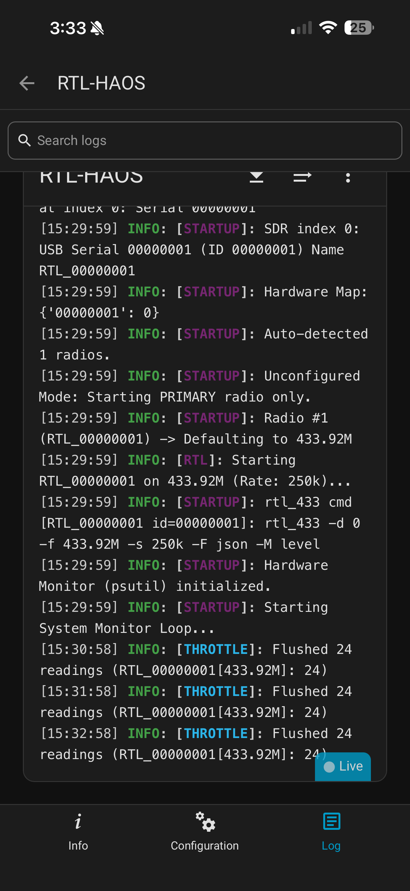

The interesting part of this design is that unlike IP-based smart home systems, RF is broadcast, unencrypted, and lacks transmission control. Any device in the space can emit signals and any device in the space can receive them so long as they have the protocol to decode the signal. There are even RF-based security systems. One would hope that they have rolling codes and other measures, but it's certainly a wild-west of information at times. A pipeline that intercepts messy RF data and automatically creates new entities will likely pick up both known and unknown devices. In fact, in `exploration.ipynb`, we find an unknown RF device that somehow got exported in our dataset. It's an interesting artifact, and while the system is a marvel, that boundary starts to feel odd at times. Realizing that strange devices mysteriously show up and emit rich telemetry makes one wonder where it may have come from.  RF has also been around for a very long time, **so there are decades of devices that operate on this frequency**. **That also allows you to make new use of old technology.**

### Software-Defined Radio Sensors and Instruments
Now that we've reviewed the pipeline from Home Assistant virtual devices > `rtl_haos` plugin that accepts the JSON output from > `rtl_433` command-line tool > serial bus > software-defined radio, we can explore the software-defined radio devices that generate our data, which flows up this pipeline and into PAMLA.

As a reminder, these RF frequency devices may have different protocols, but most of them -- including ours -- are very simple. The device turns on and emits data. It is broadcast, unencrypted, and has no transmission control or required `ack` signaling. As a result, **these devices simply turn on, emit data, and any device that can decode its protocol can intercept the data and read it.**

The devices in question are:

#### Ecowitt FineOffset WH51 Soil Moisture Sensor

As you can see below, **this is a ginger plant.** And inside the ginger plant are two soil moisture sensors (one is behind the leaves). The one behind the leaves provides **our target variable**. The soil moisture sensors have a battery in them and emit live data as long as the power source stays active. This is picked up by the USB SDR antenna in the window, which is converted to a digital signal, which is demodulated, which is ran through 380+ protocol filters, which is converted to a JSON object once `rtl_433` identifies the device. Once that happens, `rtl_haos` logs the updated data point for that soil moisture sensor, matching it by its unique hex identifier in the data. As a result, we get live data in Home Assistant from the 433 MHz sensor. 

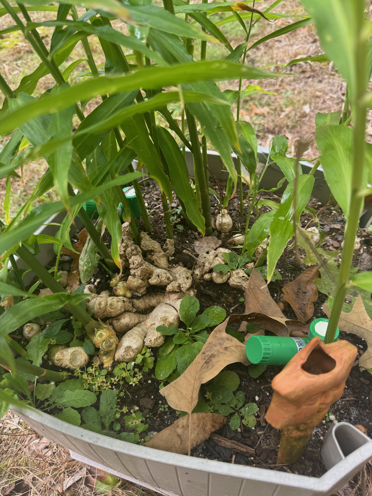

Below is a stock image of the sensor for reference. The black part goes in the soil to detect moisture. 

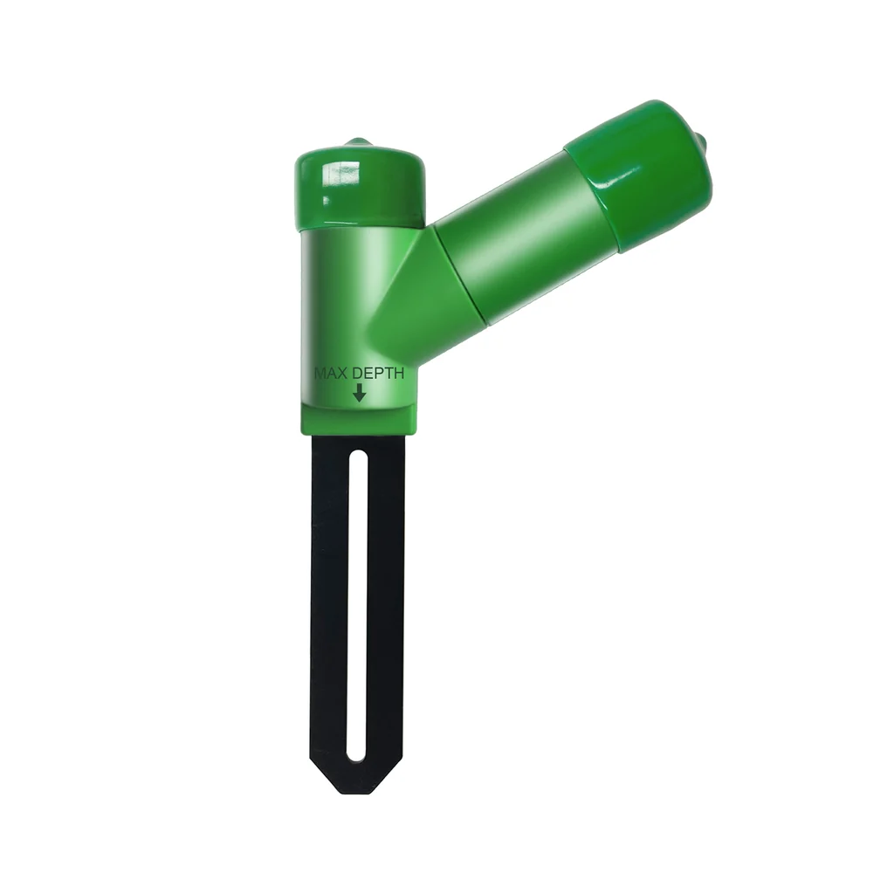

With the live data source, use Home Assistant and the `rtl_433`-compatible soil moisture sensor to monitor the ginger plant. In Home Assistant, we see the live data and its historical graphs; it also saves a lengthy history of its data. We can also set up automations based on the sensor. A notification is sent when this soil moisture sensor falls below 60% (the low-end of ginger's ideal range). As a result, **our ginger plant has been able to grow quite considerably, despite being out of its geographic tropical element.**

And below is a picture of how tall the ginger plant is, and -- perhaps more importantly -- how exposed the sensor is to the environment. It's in a clearing with direct UV exposure overhead, allowing the sensor to have exposure to the features that influence its trajectory.

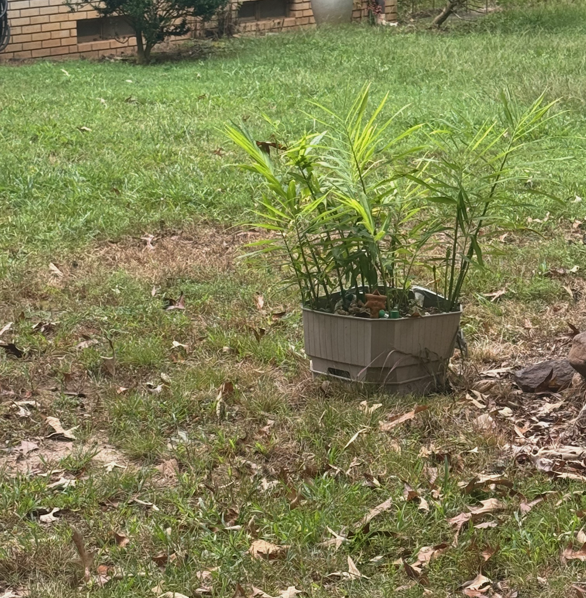

#### AcuRite Atlas A 178 Weather Station
The AcuRite Atlas A 178 weather station is the source of the majority of our data. This unique looking contraption has built-in sensors for **humidity, temperature, wind speed, wind direction, light level, rainfall, and UV index**. As with the Ecowitt Fineoffset WH51 soil moisture sensor, this is also a 433 MHz RF-based device that transmits its data in a `rtl_433`-decodable protocol.

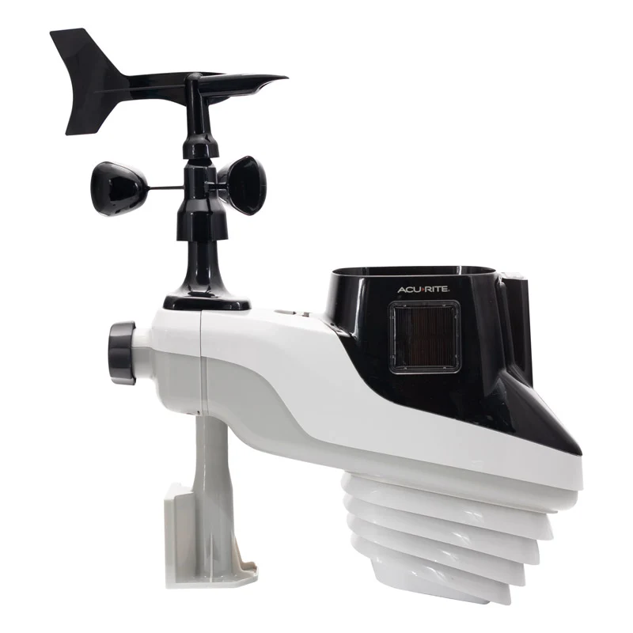

Below, you can see our actual device. It is mounted on a pole and fixed to a shed for optimal sensor placement (primarily to prevent obstacles that may block wind readings).

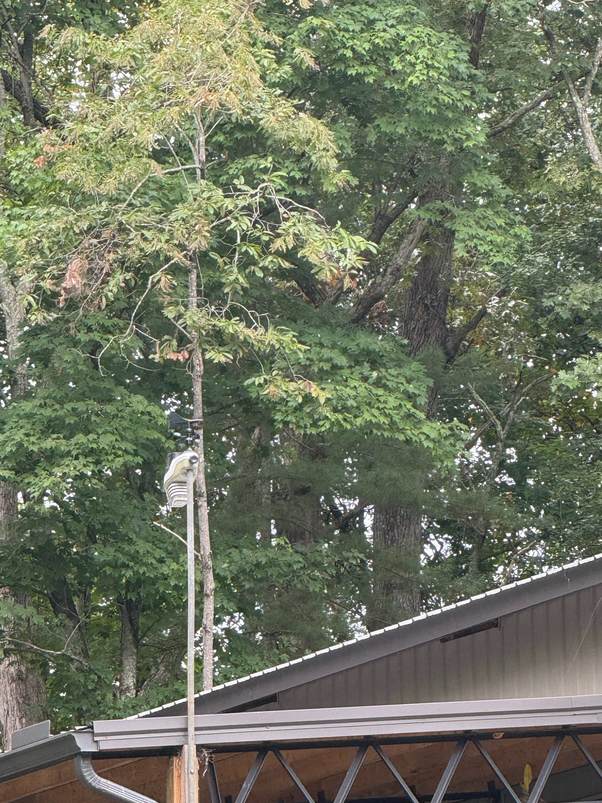

When used as prescribed by the manufacturer, this low-powered dashboard receives the RF signal and displays the data on a screen. The processing rate is fairly slow and it was discovered that many packets were actually missed, ignored, or for some other reason not displayed on the dashboard. The hypothesis is that cost optimization made completion less desirable.

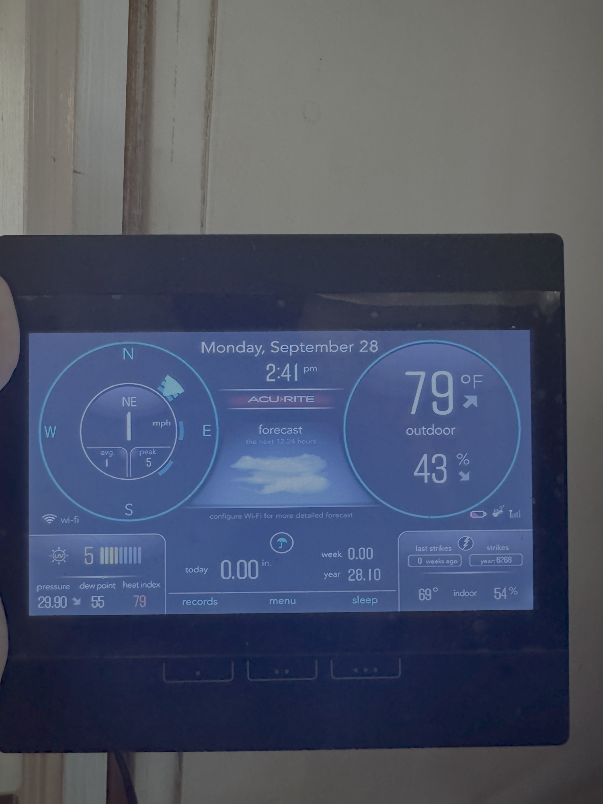

While these were taken at roughly different times, you can see a demonstration of a use case for Home Assistant. Using an old tablet, the original dashboard was replicated in better quality (with a faster sample rate and refresh rate). Additionally, you can view the same dashboard on any device on the network that has access, making it a natural pair with PAMLA.

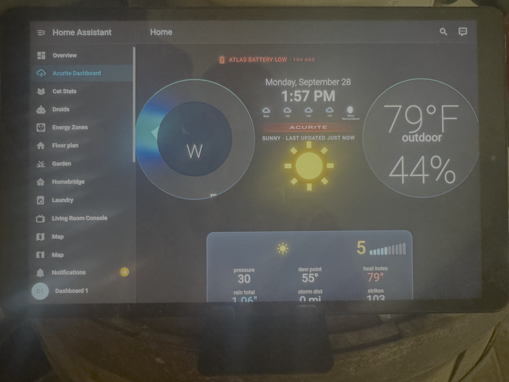

To visualize the potential of Home Assistant and our data, here is the **Acurite Atlas A 178 temperature value** for **September 30th, 12:00 AM** to **October 1st, 3:00 AM**. This demonstrates just over 24 hours of data.

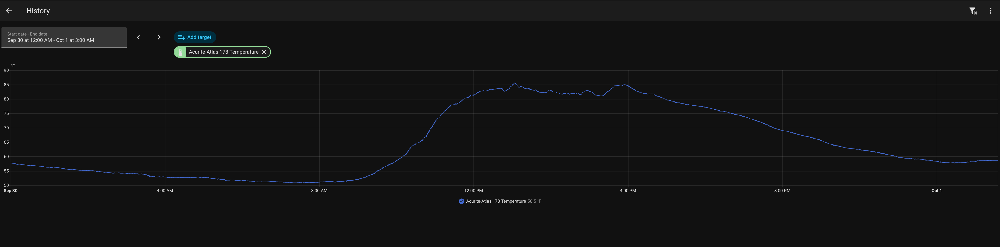

As you can see, the data is quite resolute and the trend is legible.

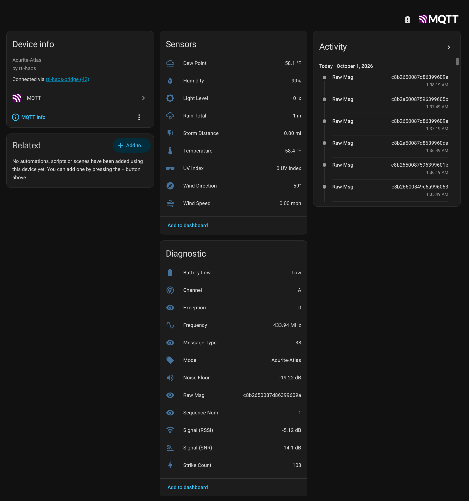

Looking at the device in Home Assistant, we can see some diagnostic information, the sensor values for that moment, and a history of raw messages received from the device in base-16 format. **This demonstrates the data collection capability that the pipeline has, and it wouldn't be possible without `rtl_433`, `rtl_haos`, Home Assistant, or the RTL-SDR team for developing the SDR antenna.** 

With this documented, we can now continue with the project.

> If the data resolution is of interest to you, **please read `exploration.ipynb` where we refine 112 columns and approx. 401,000 rows down to approx. 11 columns and 1900 rows.** 

## Architecture
Consider the following.
```text
                    ┌──────────────────────┐
                    │   External sources   │
                    │  HA/WeatherKit/User  │
                    └──────────┬───────────┘
                               │
                               ▼
┌──────────────────────────────────────────────────────┐
│                    PAMLA SERVICE                     │
│                                                      │
│ Natural language → Gemma extraction (validated)      │
│                       │                              │
│                       ▼                              │
│             validated Observation                    │
│                       │                              │
│                       ▼                              │
│          deterministic data pipeline                 │
│     rainfall / dew point / temporal features         │
│                       │                              │
│                       ▼                              │
│                    XGBoost                           │
│                       │                              │
│                       ▼                              │
│               forecast + metadata                    │
│                       │                              │
│                       ▼                              │
│             Gemma explanation layer                  │
└──────────────────────────────────────────────────────┘
                 │                    ▲
                 │                    │
                 ▼                    │
          state / history       llama-server
                                   Gemma
```

### PAMLA Service
The PAMLA service features a stateful ASGI web-based API. Being characteristically stateful by nature, the timeseries dataset that is loaded with `app.state` and built upon during runtime with user-provided hypothetical observations persists throughout the runtime of the server, or until the user manually resets the state with the interface button. 
#### Data Validation
PAMLA uses multiple custom Pydantic BaseModel subclasses (such as `Observation` and `LLMExtraction`) to validate the LLM return, the LLM's extracted `Observation` -- a user-provided hypothetical or measured observation that is to be inserted into the timeseries (generally appended). This ensures sensical values enter our DataFrame.

After LLM extraction occurs and the hypothetical observation is validated, select processing occurs using deterministic Python code to further reinforce sensical data integrity. The cumulative rainfall value is not defined by the user. The user provides an hourly rainfall observation for that hourly period and the cumulative rainfall feature receives that value as added cumulation. This prevents the user from keeping a running count of rainfall, which is not conversational or reliable. 

Dew point itself is derived of temperature and relative humidity. Unless the user explicitly states dew point, dew point is recalculated using the formula used by the Acurite Atlas A 178 weather station (Magnus-Tetens Formula). The user can override this by explicitly defining dew point, as different APIs, formulations, and hypothetical experiments may provide such. Otherwise, dew point is recalculated to enforce integrity in the relationship between features.

Temporal lag features are also created using deterministic Python code. Because our model uses rolling averages and deltas, these must be recalculated.
#### Prediction Engine
The resulting observation is added to the dataset. The user can provide any hypothetical observation desired within the bounds of PAMLA's validation layers. When a new observation is provided, the model generates a prediction of soil moisture on a 24-hour prediction horizon. This is done using XGBoost as the prediction engine. The prediction engine is reviewed in-depth in later sections.

> To train or retrain XGBoost, run `train.py`.

#### Locally-hosted, Stateful Natural Language Interface API
PAMLA uses a Gemma 3 4B locally-hosted LLM Engine ran using `llama-server`. Gemma 3 4B is an open-weight model with nearly 4 billion parameters made by Google DeepMind. By default, PAMLA uses the Gemma engine with a 4,096 token context window, which is more than sufficient for stateful API engagement. The stateful architecture maintains the evolution of the DataFrame as observations are added, allow PAMLA to persist engagement with the user efficiently and effectively. As a result, in terms of LLM context window demand, there is surprisingly little; in fact, a stateful architecture allows PAMLA to infer that if the user does not provide an updated value for a feature, and it is sensical for it to persist, then it should persist. If the user says, "What if the temperature is 50 F?", then it is implied that every other feature should be held constant and that only the variable of temperature changes. And if temperature changes, then dew point should be recalculated, unless the user explicitly stated a dew point with a different calculation or value. As a result, the stateful architecture not only allows PAMLA to persist data and context, but it allows PAMLA to require minimal data in the formulation of the request. As a result, the request could be as simple as the aforementioned temperature example. This results in additional context window headroom by way of stateful design, since the entire state doesn't need to be packed into the request. This largely possible due to PAMLA's design of a locally-hosted, locally-relevant prediction assistant. While the design asks of the API the potential of extremely long and sustained engagement that requires accurate persistence of the DataFrame to build hypothetical timeseries evolutions off of, the demands of request size and context window are quite low. 

#### Part-Containerized, Part-Baremetal
PAMLA has an optional but recommended Docker deployment. Because PAMLA requires Gemma communication on port 8080, Linux deployments should use the appropriate command-line parameters to ensure that Docker can resolve local port addresses through the special DNS usage. This issue is documented later in this README. The Docker image is built on a Python 3.11-slim build with requirements installed through the requirements file. Some requirements may be removed if not needed. Requirements in the requirements file that are included for unit testing are labeled as such. You may choose to remove said requirements prior to building the Docker image.

### The Baremetal Part (`llama-server`)

Because PAMLA uses a locally-hosted LLM (Gemma 3 4B), it requires the use of `llama-server`. `llama-server` must be running on the local machine for PAMLA to work. It also must be running for the unit tests to be performed as the LLM is tested during testing. PAMLA communicates with Gemma through port 8080, which must be available.

**`llama-server` has only been tested with PAMLA baremetal.** [While `llama.cpp` can run in a container](https://docs.servicestack.net/ai-server/llama-server), `llama.cpp` has not been tested with PAMLA and therefore is not officially supported.

> If you do use `llama.cpp` and install it through a Python installer, be mindful that environmental variables can be overrode and lead to runtime oddities. If you choose to install `llama.cpp` and test it out, ensure that the binaries can be seen in the `ag_env` Python virtual environment for PAMLA.

### Gemma 3 4B & Chat Interface
Due to the typical deployment environment of agricultural infrastructure, we've opted to go with a local LLM solution over an API integration. While it asks a bit more of the deployment machinery, it greatly improves the reliability of linchpin agricultural automation infrastructure. This greatly reduces design concerns regarding rate limits, API keys, network connectivity, and privacy of conversational data and telemetry.

To interact with PAMLA, visit the web interface that is available at http://127.0.0.1:8000 during runtime.

PAMLA has a 4,096 token context window, which is approx:

- 3,000 words
- 6 to 8 pages of standard text
- Approx. 16,384 characters
- Roughly 40 to 41 average paragraphs

Throughout our user acceptance testing, conversational schema extraction through even the most verbose of interactions did not even remotely approach that limit. Nevertheless, it is our responsibility to convey that Gemma may optimize context during longer exchanges, which may lead to the unexpected disregard or deprioritization of information. If you find yourself approaching the aforementioned context window limit approximations, please be mindful of potential optimization. The web interface also has a static reminder for reference. Context window issues are not expected; query of soil moisture need not lengthy rapport.

## Data and Feature Engineering
### Raw `dataset.csv` Dataset Overview
The dataset used in this project is an export of **Home Assistant** data. Home Assistant data can be exported by going to **Home Assistant Dashboard** > **History tab** (on the left-hand side) > select your **Start and End dates** in the top, right-hand corner, then clicking the **Overflow Menu icon** (three vertical dots) in the top, left-hand corner.

> The Home Assistant entities we've selected will be reviewed in the **Pivoted Dataset Columns** section, which is the next section in this README.

The `dataset.csv` dataset that we have -- tracked with DVC -- is an untouched export of Home Assistant data. Upon export of the selected entities, there will be **three columns in the dataset**:
- **entity_id**: Home Assistant's assigned ID of the given entity in that row. For example, an `entity_id` could be `sensor.acurite_atlas_a_178_atlas_humidity`, as it is a datapoint of the Atlas humidity sensor.
- **state**: The state (or value) of the given entity in that row. For example, a row's `state` could be a numeric value, or `unavailable`, as the sensor's value for that `entity_id` may `unavailable` at the time of the sampling observation.
- **last_changed**: The timestamp of the observation in question. For example, a row's `last_changed` value could be `2026-09-24T12:38:13.717Z`, as that could be the timestamp of the observation. The `last_changed` timestamp is reported in **UTC** and is compliant with the **ISO 8601** standard, as well as the **RFC 3339** standard.

In our example (based on a real export), the export would look as:

| **`entity_id`** | **`state`** | **`last_changed`** |
| -------- | -------- | -------- |
| `sensor.acurite_atlas_a_178_atlas_humidity` | `unavailable` | `2026-09-24T12:38:13.717Z` |

As such, you may observe that the dataset requires pivoting before use. 

> In `notebooks/exploration.ipynb`, the dataset we document the process of pivoting the dataset and trimming **400,000 lines with initial 112 features** into just over **1,900 rows and 10-11 features at the end of the notebook.**

### Pivoted Dataset Columns
After pivoting the dataset, the data sources for each entity selected in the Home Assistant export will have their own column. **As a result, this shows which entities were selected in the Home Assistant export that generated our data.** We exported sensors relating to the following devices:

- **AcuRite Atlas A 178 Weather Station**: Our multi-sensor weather station that we reviewed in the overview. It has features like temperature, wind direction in degrees, light level in lux, humidity in percentage, as well as multiple diagnostic-level features like the hexadecimal raw message value, signal, boost, SNR, noise floor, and so on. **The AcuRite Atlas seemed to have multiple entities that were used during initialization as they only showed brief reporting of `unknown`, `unavailable`, and sentinel/initial value states.** **The virtual representation of this object was much more complicated than the few features that were extracted, but the data cleaning process revealed the valuable features by `entity_id` name directly As a result, future PAMLA ingestion can start with the correct features from the start.**
- **Ecowitt Fineoffset WH51 Soil Moisture Sensors**: The multiple WH51 soil moisture sensors were exported. Many of these were not relevant to our experiment, and each had multiple diagnostic-level rows as well. Our approach during V1 was to use more "pure" datapoints this time, and save experimental raw values and SNR-based variables for a different time.
- **Sun and Moon**: Virtual sun and moon objects in Home Assistant. The desire was to augment the hyperlocal data with globally-relevant data from these celestial bodies; however, the data only went back 10 days, so they were dropped. While imputation would be possible based on historical data, it would not be best practice to do so (methodologically speaking or for pipeline refinement). The light level is measured by the weather station; that goes beyond positioning and tells us an obstruction-aware value. Moon phase would be interesting to obtain in future versions.
- **Relevant automations and Home Assistant Feature Engineering**: Included were virtual humidity sensor and weather station-relevant automations and engineered features, like alternative calculations of dew point.
- **tfa_303151_16**: This device was somehow accidentally exported, and its origin is not known. Earlier, we documented that `rtl_haos` automatically creates objects for every 433 MHz RF device that `rtl_433` and the SDR antenna decodes. **This is an example of that.** At some point, this device was detected by our data pipeline and ingested, and accidentally made it into the export. It was dropped. This does demonstrate the nature of our data pipeline quite well, and is an interesting artifact to include when discussing the RF > Home Assistant > PAMLA pipeline. Devices can be ingested and their data travel as far as the preprocessing stage of PAMLA without the user even knowing of their existence. This device likely belonged to a local neighbor, resided in a vehicle, or belonged to a business that resides near the residence at which this experiment took place.


As described in `exploration.ipynb`, once the dataset is pivoted, we get the following columns:
```
{'automation.ginger_low_humidity',
 'binary_sensor.acurite_atlas_178_battery_low',
 'binary_sensor.atlas_condensation_risk',
 'binary_sensor.fineoffset_wh51_0f85e7_battery_low',
 'binary_sensor.fineoffset_wh51_0f8613_battery_low',
 'binary_sensor.fineoffset_wh51_0f861a_battery_low',
 'binary_sensor.fineoffset_wh51_0fa7d7_battery_low',
 'binary_sensor.fineoffset_wh51_0fa9d0_battery_low',
 'binary_sensor.none_atlas_battery_ok',
 'sensor.acurite_atlas_178_channel',
 'sensor.acurite_atlas_178_dew_point',
 'sensor.acurite_atlas_178_exception',
 'sensor.acurite_atlas_178_frequency',
 'sensor.acurite_atlas_178_humidity',
 'sensor.acurite_atlas_178_light_level',
 'sensor.acurite_atlas_178_message_type',
 'sensor.acurite_atlas_178_model',
 'sensor.acurite_atlas_178_noise_floor',
 'sensor.acurite_atlas_178_rain_total',
 'sensor.acurite_atlas_178_raw_msg',
 'sensor.acurite_atlas_178_sequence_num',
 'sensor.acurite_atlas_178_signal_rssi',
 'sensor.acurite_atlas_178_signal_snr',
 'sensor.acurite_atlas_178_storm_distance',
 'sensor.acurite_atlas_178_strike_count',
 'sensor.acurite_atlas_178_temperature',
 'sensor.acurite_atlas_178_uv_index',
 'sensor.acurite_atlas_178_wind_direction',
 'sensor.acurite_atlas_178_wind_speed',
 'sensor.acurite_atlas_a_178_atlas_humidity',
 'sensor.acurite_atlas_a_178_atlas_illuminance_lux',
 'sensor.acurite_atlas_a_178_atlas_lightning_distance_km',
 'sensor.acurite_atlas_a_178_atlas_lightning_distance_mi',
 'sensor.acurite_atlas_a_178_atlas_lightning_strike_count',
 'sensor.acurite_atlas_a_178_atlas_noise',
 'sensor.acurite_atlas_a_178_atlas_rain_total_in',
 'sensor.acurite_atlas_a_178_atlas_rain_total_mm',
 'sensor.acurite_atlas_a_178_atlas_rssi',
 'sensor.acurite_atlas_a_178_atlas_snr',
 'sensor.acurite_atlas_a_178_atlas_temperature_degc',
 'sensor.acurite_atlas_a_178_atlas_temperature_degf',
 'sensor.acurite_atlas_a_178_atlas_uv_index',
 'sensor.acurite_atlas_a_178_atlas_wind_avg_mph',
 'sensor.acurite_atlas_a_178_atlas_wind_direction_deg',
 'sensor.acurite_atlas_dew_point',
 'sensor.acurite_atlas_dew_point_simple_formula',
 'sensor.atlas_wind_direction',
 'sensor.dashboard_moon_phase',
 'sensor.fineoffset_wh51_0f85e7_ad_raw',
 'sensor.fineoffset_wh51_0f85e7_battery_voltage',
 'sensor.fineoffset_wh51_0f85e7_boost',
 'sensor.fineoffset_wh51_0f85e7_frequency',
 'sensor.fineoffset_wh51_0f85e7_frequency_2',
 'sensor.fineoffset_wh51_0f85e7_integrity_check',
 'sensor.fineoffset_wh51_0f85e7_model',
 'sensor.fineoffset_wh51_0f85e7_noise_floor',
 'sensor.fineoffset_wh51_0f85e7_signal_rssi',
 'sensor.fineoffset_wh51_0f85e7_signal_snr',
 'sensor.fineoffset_wh51_0f85e7_soil_moisture',
 'sensor.fineoffset_wh51_0f8613_ad_raw',
 'sensor.fineoffset_wh51_0f8613_battery_voltage',
 'sensor.fineoffset_wh51_0f8613_boost',
 'sensor.fineoffset_wh51_0f8613_frequency',
 'sensor.fineoffset_wh51_0f8613_frequency_2',
 'sensor.fineoffset_wh51_0f8613_integrity_check',
 'sensor.fineoffset_wh51_0f8613_model',
 'sensor.fineoffset_wh51_0f8613_noise_floor',
 'sensor.fineoffset_wh51_0f8613_signal_rssi',
 'sensor.fineoffset_wh51_0f8613_signal_snr',
 'sensor.fineoffset_wh51_0f8613_soil_moisture',
 'sensor.fineoffset_wh51_0f861a_ad_raw',
 'sensor.fineoffset_wh51_0f861a_battery_voltage',
 'sensor.fineoffset_wh51_0f861a_boost',
 'sensor.fineoffset_wh51_0f861a_frequency',
 'sensor.fineoffset_wh51_0f861a_frequency_2',
 'sensor.fineoffset_wh51_0f861a_integrity_check',
 'sensor.fineoffset_wh51_0f861a_model',
 'sensor.fineoffset_wh51_0f861a_noise_floor',
 'sensor.fineoffset_wh51_0f861a_signal_rssi',
 'sensor.fineoffset_wh51_0f861a_signal_snr',
 'sensor.fineoffset_wh51_0f861a_soil_moisture',
 'sensor.fineoffset_wh51_0fa7d7_ad_raw',
 'sensor.fineoffset_wh51_0fa7d7_battery_voltage',
 'sensor.fineoffset_wh51_0fa7d7_boost',
 'sensor.fineoffset_wh51_0fa7d7_frequency',
 'sensor.fineoffset_wh51_0fa7d7_frequency_2',
 'sensor.fineoffset_wh51_0fa7d7_integrity_check',
 'sensor.fineoffset_wh51_0fa7d7_model',
 'sensor.fineoffset_wh51_0fa7d7_noise_floor',
 'sensor.fineoffset_wh51_0fa7d7_signal_rssi',
 'sensor.fineoffset_wh51_0fa7d7_signal_snr',
 'sensor.fineoffset_wh51_0fa7d7_soil_moisture',
 'sensor.fineoffset_wh51_0fa9d0_ad_raw',
 'sensor.fineoffset_wh51_0fa9d0_battery_voltage',
 'sensor.fineoffset_wh51_0fa9d0_boost',
 'sensor.fineoffset_wh51_0fa9d0_frequency',
 'sensor.fineoffset_wh51_0fa9d0_frequency_2',
 'sensor.fineoffset_wh51_0fa9d0_integrity_check',
 'sensor.fineoffset_wh51_0fa9d0_model',
 'sensor.fineoffset_wh51_0fa9d0_noise_floor',
 'sensor.fineoffset_wh51_0fa9d0_signal_rssi',
 'sensor.fineoffset_wh51_0fa9d0_signal_snr',
 'sensor.fineoffset_wh51_0fa9d0_soil_moisture',
 'sensor.moon_phase',
 'sensor.sun_next_dawn',
 'sensor.sun_next_dusk',
 'sensor.sun_next_midnight',
 'sensor.sun_next_noon',
 'sensor.sun_next_rising',
 'sensor.sun_next_setting',
 'sensor.tfa_303151_16_humidity',
 'sun.sun'}
```

### Data Cleansing and Exploratory Analysis

> If you first open `exploration.ipynb`, ensure that the environment in the top-right corner of the code pane says `ag_env (Python 3.11.x)`.

The `exploration.ipynb` file contains the process of working down approx. 112 columns and 400,000+ rows of data to approx. 11 columns with just under 2,000 rows of data. It shows data pipeline and telemetry discoveries, Home Assistant anomalies, and features that were near-conception, but did not make the cut for one reason or another. Features are graphed and visualized, leading to a deeper understanding of the problem space. It is certainly worth a brief visit if it is of interest to you.

`predictive-ag-ml-assistant/notebooks/exploration.ipynb` is where you can find the notebook if interested (and time permits)!

**For assembling datasets and crafting pipelines**:

- It is imperative that your dataset have at least one observation within the 5 minute window leading up to the hour. Between Home Assistant’s direct plugin and the Homebridge plugin publishing data via MQTT to Home Assistant, the 5-minute window requirement and a 1 sample per hour sample rate was found to be sufficient for all infrastructure eras.
- 5/60 is 8.33% of an hour, which is meaningful relative to the sampling interval. Minimizing variance in sampling periodicity helps eliminate unnecessary variables and enforces integrity in sampling conduct.

### Dew Point Validation

Data validation on the PAMLA interface is easy when you know the relationships between columns.

For example:
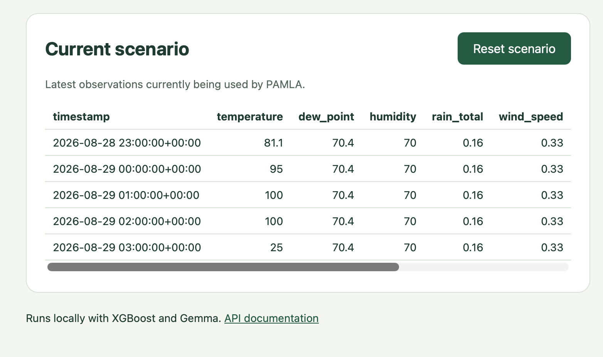 Here, we started out with temperature=81.1, dew point=70.4, and humidity = 70.
Those were real-world values, obtained by the Atlas A178. After that, we had 4 rows where we added mock data. We tried:

- temperature = 95
- temperature = 100
- temperature = 100 again
- temperature = 25

And while humidity held, dew point didn't change.

Dew point is derived of both temperature and relative humidity. There are two common-place methods of calculating dew point. There's a simple approximation that loses accuracy when humidity is past 50%, and there's the more accurate calculation (Magnus-Tetens Formula) that is much more scientifically appropriate. Both are derived of temperature and relative humidity, but we'll examine Magnus-Tetens as it is the more appropriate calculation for our purposes.

To find dew point ($T_{d}$ in °C) from ambient air temperature (T in °C) and relative humidity (RH in %), the formula is:
$$
T_{d}=\frac{b\cdot \alpha (T,RH)}{a-\alpha (T,RH)}
$$

Where the intermediate α(T, RH) is calculated as:
$$
\alpha (T,RH)=\frac{a\cdot T}{b+T}+\ln \left(\frac{RH}{100}\right)
$$

As you can see, changes in temperature and relative humidity would result in direct changes of dew point. While our LLM may have appropriately changed temperature only based on our instructions, changing temperature while maintaining dew point in humidity results in a potential data validation failure. The relationship between dew point, temperature, and relative humidity can make those predictions inconsistent with historical data relationships; and the dew point value -- as an output of a function with temperature and relative humidity -- may be mathematically nonsensical.

To fix this, dew point itself is recalculated unless explicitly overridden by the user.

```
    # 3. Append a hypothetical row when something changed
    if changes:
        new_df = observation_to_df(observation, df)
        df = extend_dataframe(df, new_df)

        # Recalculate dew point unless the user explicitly supplied one
        if "dew_point" not in changes:
            latest = df.index[-1]

            df.loc[latest, DEW_POINT_COLUMN] = calculate_dew_point_f(
                df.loc[latest, TEMPERATURE_COLUMN],
                df.loc[latest, HUMIDITY_COLUMN],
            )

        # Persist the completed hypothetical observation
        app.state.df = df

```

As a result, our data becomes sensical once again:
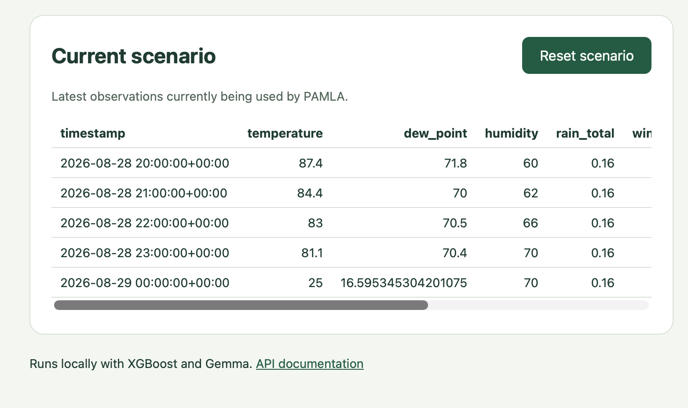

Conversationally, the user shouldn't be expected to explicitly provide complex calculations that require natural logarithmic calculations.

**We shouldn't force the user to produce a mathematically-sound equilibrium of temperature, humidity, and dew point**, an empirically-plausible quantity of rainfall, or a likely estimate of light level. 

The natural interpretation is that the user wants to know what happens if everything stayed constant, but temperature changed. They aren't trying to break the universe simulator by pushing two independent variables and some constants past their mathematical limits. A change in temperature and/or humidity should naturally result in a new dew point calculation.

**But there is a use case for the manual override.** While our XGBoost is trained on Acurite Atlas A 178 sensor data in this domain, the user may want to use alternative systems, alternative formulations, external data sources (see the Apple Shortcuts section), or additional prediction models to predict soil moisture. If the user obtains absolute future forecast data from a third-party service, and that service happens to use the **Simple Formula** for dew point -- or even a new novel calculation -- we should allow the experiment to occur. Additionally, if the user is testing out hypothetical data, or wants to simply experiment with variable manipulation, they should be allowed to do so. Perhaps they want to experiment in applying an additional weight or bias to dew point. If the user explicitly defines it, then it should be allowed; however, future iterations may request additional clarification if feedback pushes design in a different direction.

### Rainfall Validation

We have a similar approach with rainfall, where our `rain_total` column is updated with reliable deterministic programming logic in Python. While the LLM Layer interprets and extracts rainfall changes for a specific hourly `Observation` -- as per our schema -- functional programming in Python reinforces data ingestion by taking the rainfall changes reported by Gemma and adding the delta to the previous row (in accordance with the nature with the cumulative feature).

```
def observation_to_df(
    observation: Observation,
    original_df: pd.DataFrame,
) -> pd.DataFrame:
    """Convert a validated observation to PAMLA's sensor DataFrame schema."""

    data = observation.model_dump(
        by_alias=True,
        exclude_none=True,
    )

    rainfall = data.pop("rainfall", None)

    if rainfall is not None:
        previous_rain_total = original_df[RAIN_TOTAL_COL].iloc[-1]
        data[RAIN_TOTAL_COL] = previous_rain_total + rainfall

    return pd.DataFrame([data])
```

> This can be reviewed in `exploration.ipynb`. The Acurite Atlas A 178 weather station returns a cumulative rainfall value. The cumulative rainfall value resets to 0 when it reaches approx. 5 inches of rain. With this, we were able to engineer an hourly rainfall feature based on temporal deltas in the cumulative rainfall feature.

Because our LLM's scope is focused on extracting the next observation in the time series (by design), the hourly rainfall feature is the natural candidate for LLM observation feature extraction. It would not be conversational, or good user experience to ask them to perform additional calculations for an intuitive hypothetical measurement.

As such, our model extracts `rainfall`, the amount of rainfall that occurs in the next observation.

### Pipeline and Domain Knowledge

By limiting the default scope of the LLM to gathering data on a specific hourly observation, we enable the innate interoperability potential that LLMs have, reaping its benefits in HCI intimacy; as a result, Data Engineering, formatting, collection methodology, and concise but effective code becomes the infrastructure that potentiates the LLM. Here, even a timeseries experiment in a noisy, complex domain like weather can act quite tabularly, which in turn potentiates our XGBoost. While this is just a short segment of the code in this project, it's worth highlighting as it outlines the commensurability of the stack, while demonstrating how its achieved capacity can be largely dependent upon reinforcing pipelines to enable graceful recovery where failures may arise.

Which returns me to the previous point of this section: **data validation can be easy when you know the relationships between columns.** For every known relationship between weather features -- like dew point and its derivation of temperature and relative humidity -- there are an unknown quantity of weather patterns that we do not know. If we did know them all, weather prediction may not be as fallable as it is now. Therefore, the ability for a given engineer to potentiate the pipeline may be potentiated itself by our collective understanding of the domain, as unknown gaps in pipeline reinforcement can cause performance diminishment. Nevertheless, our ability to measure performance itself can actually help us identify where these gaps are, which in turn can in fact enable domain knowledge discovery.

## Modeling and Experiment Tracking

### MLFlow Dashboard

This experiment uses **MLFlow** to identify the model with the best performance. Performance metrics, hyperparameter, and parameter configurations are logged.

Programmatic model selection: XGBoost hyperparameter configurations are logged as individual MLflow runs. mlflow.search_runs() queries only the completed runs created by the current tuning session and orders them by cross-validation RMSE. The best run's parameters are then used to train the final held-out XGBoost model.

The model iterations, their metrics, and their configurations can be seen on the MLFlow dashboard:

```
127.0.0.1:5000
```

> To find the best model, search: `metrics.test_r2 > 0.56`


## Results

### XGBoost Hyperparameter Tuning

As a reminder, **we split our data 80/20 into training and testing portions of the dataset**. Instead of a standard chronological split, we used a **chronological cross-validation methodology**. 
 
The rationale is that a conventional split of a single chronological stream would call attention to a massive nuance in our dataset -- our sampling period (after data cleaning) shrunk from **January to August** to **June to August**. Since our dataset covers just three months and a tumultuous season change, **a model trained exclusively on June-July weather may not perform ideally when predicting environmental targets for late August**. Being on the cusp of season changes, an 80/20 split based on a standard split's temporal boundary would result in a form of temporal sampling bias, where the resulting splits are characteristically opposed due to seasonal weather evolution. Therefore, a solution was needed to allow the model to gain sampling exposure across the entire time period, not just train on the early months and predict near-September data. The apportionment is not inherently problematic; we can still reserve a 20% volume of the dataset for testing, but **the training and testing data should be spread across June, July, and August to help equalize the natural evolution of cross-seasonal temporal weather data.**

As a result, we opted to use **a 5-fold chronological cross-validation TimeSeries split**.  In accordance with our 24-hour prediction horizon, we used a 24-hour **purge gap** to prevent data leakage from occurring across the training-testing boundary split.

Hyperparameter tuning was performed on the training portion of the data, training on the five-fold cx cross-validation data (with a 24-hour purge gap at the boundary). We evaluated eight different XGBoost models using mean RMSE as our key performance metric, which penalizes errors in accordance with their severity, and represents the error in our standard, human-legible unit (percent soil moisture). A pseudo-RNG `random_state` of **42** was used to ensure consistent replication of results across runtime iterations.

The favored configuration used:

- 100 estimators
- learning rate of 0.05
- maximum tree depth of 3
- random_state: 42
- n_jobs: -1

From our day-1 untuned model configuration, this configuration resulted in mean cross-validation RMSE improvements going from **2.2340 RMSE in the initial configuration** to **2.1041 RMSE in the favored configuration**.

> **NOTE:** For the purpose of continuous model development, **a fresh run of `train.py` now uses the favored XGBoost model as the new initial model.** When you run `train.py`, it will initialize XGBoost with the hyperparameters above. 
> 
> As a result, **if you deploy PAMLA with the same data and model selection configuration, there will be zero-change in RMSE** from the initial XGboost to the favored XGBoost; the initial and the best model will **both have a Root Mean Squared Error of 2.1041**.
> 
> **This is an intentional design choice as this continuous development and evolution is expected.** As this is our new baseline XGBoost model, further PAMLA improvements that result in XGBoost performance gains (or losses) will be printed relative to the currently-favored configuration during hyperparameter optimization.

The tree model favored a rather simple decision tree with a `max_depth` of 3 in our sequential learning model. With our focus on sequential refinements of residuals, paired with XGBoost's built-in regularization that assists in preventing overfitting and unoptimal complexity, it is of little surprise that a simple tree structure was favored. 

> While we did not directly configure L1 (`reg_alpha`) or L2 (`reg_lambda`) hyperparameters directly, by default, `reg_alpha = 0` and `reg_lambda = 1`. As a result, we did have active L2 regularization during training. 

With this, one could be optimistic that the favored hypertuned XGBoost will have some resilience to overfitting when exposed to the remaining portion of the dataset (testing set); ergo, we will expose our favored configuration above to the testing set and observe the results.

### Model Performance
The model performance will be evaluated. The following demonstrates the mean absolute error, root mean squared error, and R² for each model -- Random Forest, our tuned XGBoost, MLP, and the Persistence (baseline) model.

| Model | MAE | RMSE | R² |
|---|---:|---:|---:|
| **Persistence Baseline** | **3.3242** | **4.3185** | **0.7762** |
| Random Forest | 5.2239 | 7.3777 | 0.3468 |
| Tuned XGBoost | 4.4499 | 6.0259 | 0.5642 |
| MLP | 7.5763 | 11.9802 | -0.7224 |

As you can see, **our hypertuned XGBoost model resulted in approx. 4.45% MAE, approx. 6.03% RMSE, and an R² of approx. 0.56.** The model has not demonstrated evidence of overfitting, as not only did prediction performance sustain from training to testing, but overall improvements in performance were observed.

While PAMLA was only exposed to data ranging from June to late August (nearly September), that time range does have some environmental variety. We've both trained and tested the XGBoost on various portions of that dataset, and predictive performance improved from training to testing. As far as supporting this model's **temporal adaptability**, it has demonstrated consistent performance across our 5-fold chronological cross-validated dataset. Focusing specifically on the principle of temporal predictive adapatability, predictive performance sustained and improved from training to testing, suggesting promise in using this model for timeseries adaptability -- a requirement of our domain. Optimistically, the model may have resiliance across temporal seasonal changes, but this would need to be confirmed with further exposure to temporally diverse environmental data. 

If the predictive performance of this architecture proves to be reliable through temporal diversity, one may conclude that our model's continued performance would be a result of the model learning **physics-informed ecological relationships** as opposed to **seasonal behavior of the given region**. Naturally, this would mandate exposure to additional regions until the bounds of performance either break, or the model proves to be generally applicable to the planet Earth.

But what we can demonstrate now is that **in testing, the final hypertuned XGBoost prediction model explained approx. 56.4% of variance in soil moisture occurring 24 hours in the future on the testing set, with a MAE of approximately 4.45% soil moisture.**

### Persistence Baseline and R²

While the deterministic persistence model *did* best our intelligent prediction model, the purpose of our V1 model was not to chase R2 improvements, but to forge the data pipeline and form a structural foundation for continued improvement. While many features were dropped due to temporal gaps in data collection (and many other reasons), we ended up with extremely strong environmental features that were collected with scientific sensors and instrumentation, specifically designed with precision in mind. As a result, V1 stands as a potent environmental prediction model. Excluding human-watering data allowed us investigate how much soil-moisture variation the environmental inputs could explain. The model’s observed misses also revealed where those inputs and this modeling approach fell short. Including historical watering data would likely greatly improve performance in prediction; however, answering the environmental-only question was interesting, and arguably a solid foundation for V1, as it forms the pipeline from 433 MHz data collection equipment to a prediction model. While human influence is certainly present and logging it is an impactful next step towards explaining trends in soil moisture, the V1 model is a strong core model to build from.

While we've justified the existence of this model, **we still need to compare its performance against that of the baseline model.** There are a few reasons that the persistence model sets such a high bar to beat.

- **In this domain, a broken clock is right 77% of the time.** Soil moisture in a concrete plant pot acts much like an equilibrium. Water is added, much of the excess volume drains, and an equilibrium is achieved. **This equilibrium is roughly achieved fairly quickly.** Based on historical soil moisture and the environmental features, the new equilibrium will stabilize at some value. From there, a **slow, persistent decay** reduces soil moisture slowly as it continuously re-stabilizes based on environmental conditions. With rain, it can rebound and increase some relatively small amount as rain sustains. But given the environment our experiment was conducted in (North GA, USA), the persistent decay rate can be, at times, quite minor. It would not be unusual for soil moisture to sustain the same relative discrete percentage for some period of time -- **often longer than 24 hours**. As a result, a persistent model can be quite effective in predicting an inherently persistent value without actually being an intelligent system.
- **The problem space/domain is unusually noisy and unpredictable.** Weather prediction is a prime example of a noisy environment. Even in high-impact, high-demand areas of study, such as hurricane tracking, many different models exist, and these prediction models can vary greatly in prediction. While there are some major variables that help determine soil moisture, there are a vast amount of minor details that can greatly influence "normal" behavior. Winds bring in air with different qualities from other areas, soil quality can vary with different minerals, fertilizers, fungi, moss, rocks, plants, insects, wildlife, the plant itself can absorb and deposit water based on its species, health, and age, different points of soil may have enhanced exposure or resistance to specific features, the position of a pot and its soil moisture sensor may be weighed additionally by gravity, and so on. For our experiment, we used a concrete pot on relatively even ground with outdoor exposure in clearing, so fortunately some variables have been accounted for; however, the environmental factors must be considered when attempting to collect data with equipment that has direct, constant outside exposure in an evolving, active climate.
- **Our model is designed to predict future soil moisture at a 24-hour horizon.** PAMLA uses data collected from this noisy domain to do something some might find to be conceptually impossible -- **the model is predicting soil moisture tomorrow -- 24 hours from the last datapoint -- without knowing tomorrow’s weather**. 24 hours is a meaningful prediction. A 12-hour shorter-horizon was considered. Naturally, a shorter horizon results in higher accuracy for the model. Regardless, the 24-hour horizon was maintained as it set a more challenging, yet rewarding bar. **A longer, 24-hour horizon distances the prediction from prediction-contemporaneous events, like rainfall, unexplained watering, or acute dew point changes.** Theoretically, this poses a more challenging question that requires more sophistication than acute impact -- in fact, the impact of many acute events are likely considerably diminished within 24 hours, and could not reliably be used to predict moisture. However, the other side of that coin is that **a 24-hour prediction horizon -- by design -- is blind to the impact of an entire day's worth of weather at inference.** As such, a non-negligible portion of the unexplained data may be influential weather trends and events that occur. For example, how much does light level (lux) help when the model doesn't know how much sun exposure the plant had that day? Surprisingly, our feature interactions tell us that is was 10/15 features. It actually placed higher than wind direction. One may have expected the wind direction to foreshadow incoming storms from the east, or a looming cloud cover; yet, it seems that -- like the persistent model -- yesterday's light level may be a useful indicator of tomorrow's soil moisture, based on the persistent and cyclical nature of the weather. While we did leverage some rolling lag features (deltas and averages), perhaps calculating additional historicals could improve performance. Perhaps 24-hour, day-to-day based prediction is a different question than acute, hourly short-horizon prediction.
- **There is a lack of human-initiated additive water volume metrics.** As we've discussed, this data pipeline did not include metrics for a considerable source of influence on the target variable. But even without what one might assume to be a major influence of soil moisture (human intervention), the model is still able to explain over 56% of all variance in the held-out target dataset. Despite the room for improvement in the data pipeline, the model still explained the majority of the data in an exceptionally noisy environment 24 hours out without having data on acute influence. While we could enhance the model with the imputation of historical Sun and Moon data next, or generated every possible feature interaction, perhaps our efforts would best be reserved for incorporating the logging of human-initiated watering data first, then augmenting the dataset with more historical lag features, as the baseline seems to have success with its reliance on historicals.

### MAE and Sensor Accuracy
In terms of the situational significance of 4.45% soil moisture, we could consider it to be considerable, but not fatal. The target soil moisture for ginger is between 60 and 70 percent humidity. A prediction being off by about 4.45 percentage points could be considerable, but predictions could just as easily be qualified and contextualized with error metrics in mind. Ultimately, the MAE also depends on empirical data ranges. Sensors themselves also have an error margin. **The Ecowitt Fineoffset WH51 soil moisture sensor used has an accuracy error margin of ±5%, with a 1% resolution.** The most important distinction is that our model is not predicting **absolute soil moisture** -- it is predicting **what the WH51 Fineoffset reports the soil moisture to be.** 

Consider these possible natures of sensor error:

- **If the soil moisture sensor has a conditional tendency misread the soil moisture by up to 5% based on operating conditions**, and the model sometimes mispredicts by give-or-take 4.45%, they may conveniently equalize at times; at times, one is above the true value, and one is below the true value. Some error on both sides "cancel out" and the prediction is unintentionally close to the true reading. But at times, if they error in the same direction -- under-reporting and under-predicting based on that under-report, or an over-reading where the model incorrectly over-predicts based on that -- the real-world impact would be greater. This could lead to exceptionally messy performance. At the end of the day, our model would likely do best when the sensor reporting is deterministic to the weather.

- **If the sensor's error nature is more variant and "noise-like"** -- it occasionally misses a single observation by a single percent here, a random 3-percentage dip there, 5 percent on a particularly hot and muggy day -- then the XGBoost's built-in loss-function can actually help counteract these occasional, contextual, sporadic reporting blips.

- **If there's some distribution to its sensor error -- for example, it is accurate at 50%, but as soil moisture approaches 0 or 100%, sensor error from the actual soil moisture deterministically changes** -- then the model may adapt, but the values and predictions in that range do not reflect reality. In this case, it would be extremely important to realize that the model is trained on these specific sensors, and weights, biases, and outcomes may be biased to the original sensor bias.

Perhaps predicting soil moisture 24 hours out gives us an advantage. We can use rolling lag features -- such as averages -- to potentially offset certain types of sensor errors. But frankly, a multi-sensor array expansion -- one with different sensor types/manufacturers and even sensor technologies -- may be of value. Sensor interoperability with this model should not be assumed or guaranteed. And ultimately, an experiment should be conducted to contextualize the MAE value as it relates to the existing model and sensor combination. The error nature of the model itself should be studied in relation to the reported sensor data, and error nature for each sensor should be studied as it may reveal error presence that is not visible to us with model testing and the data alone. For this reason, we remember that we are predicting **the WH51 Fineoffset soil moisture sensor value** -- not soil moisture directly.

### XGBoost Feature Importance

Below, we have a table showcasing the final model feature importances.

| Rank | Feature | Importance | Percentage |
|---:|---|---:|---:|
| 1 | Soil moisture, 6h rolling mean | **0.247281** | **24.73%** |
| 2 | Soil moisture, 12h rolling mean | **0.169125** | **16.91%** |
| 3 | Current soil moisture | **0.166633** | **16.66%** |
| 4 | Cumulative rain total | **0.094374** | **9.44%** |
| 5 | Temperature | **0.050969** | **5.10%** |
| 6 | Hourly rainfall | **0.047360** | **4.74%** |
| 7 | Soil moisture change, 6h | **0.047303** | **4.73%** |
| 8 | Soil moisture change, 1h | **0.044344** | **4.43%** |
| 9 | Soil moisture change, 3h | **0.034159** | **3.42%** |
| 10 | Light level | **0.028338** | **2.83%** |
| 11 | Wind direction, sin | **0.025481** | **2.55%** |
| 12 | Dew point | **0.021433** | **2.14%** |
| 13 | Humidity | **0.012942** | **1.29%** |
| 14 | Wind speed | **0.009937** | **0.99%** |
| 15 | Wind direction, cos | **0.000322** | **0.03%** |

**Recent soil state dominates in importance. Direct additive water is key as well, with temperature trailing it, standing distinctly higher than other environmental variables. The remaining environmental variables provide smaller contributions, but are likely critical to contextualize the current state and additive volume. There are no negative features, indicating a comfortable signal-to-noise ratio in our feature space.**

From this, some observations can be made: 

- **Aside from some recent state columns, rainfall was largely influential.** This supports our hypothesis that our prediction model is strong, as the current equilibrium and trajectory are most important, followed by things that may directly add some considerable volume of water to the soil. We've identified that -- for our specific application -- we had a considerable amount of human intervention in soil moisture. Unfortunately, the volume was not logged in the same method as rainfall. And here, we can see how important that feature is. Outside of the current state, it is the most important feature. If we were to include measuring that data in the pipeline, automate and measure irrigation, or deploy our model to an environment where human intervention is not a variable, then the model should perform much better. Simply put, our intervention is noise in some environments, and an unlogged major feature in others.

- **We see that environmental factors are certainly valuable, and can be as valuable as even direct additive water sources.** Temperature itself surprisingly ranked slightly higher in importance than our engineered hourly rainfall feature, and just under cumulative rainfall. This is sensical as it ultimately aligns with our equilibrium observation of the problem space. The model heavily weighs rolling soil trends/averages, how much rain is added, and the environmental temperature. The temperature is likely the biggest influence logged pertaining to the Water Cycle, as it can indicate whether water in both the soil and environment will condense or evaporate.

- **Wind direction (sin) ranks substantially higher wind direction (cos).** This interesting as it can mean very different things based on the model's use of the feature. It may simply find sin to be a suitable indicator of wind direction as a derivative, leaving sin to be less important. While it may have weighed sin much higher than cos, it may simply imply derivation of general wind direction -- not how much emphasis it places on the actual vertical magnitude of the wind. Alternatively, it could indicate a much more interesting phenomenon -- it may be related to a meteorological trend or pattern, such as the air origin of the wind. Further experiments should investigate whether this reflects a meaningful meteorological pattern. Ultimately, it may require professional meterologist consultation.

- **Interestingly, XGBoost didn't find the dew point feature interaction exceedingly valuable when compared to temperature.** Dew point -- a weather station-provided, physics-informed feature interaction -- ranks relatively low in feature importance. Even more interestingly, it ranked humidity to be less important than temperature. This may not suggest that air humidity is important -- it may simply weigh temperature and the actual soil historical data much higher. Humidity still may be useful in some datasets -- and could potentially foreshadow weather events -- but direct soil and air temperature seems to be of more importance. But there is a *potential* pattern showing -- when features indicate a relationship -- like cosine/sine of wind, or dew point, humidity, and relative humidity -- it may choose a strong derivative (especially if it has standalone importance for some other reason) and rely on that, as opposed to feature interactions and explicitly spelled-out relationships. If that's the case, that may deprioritize feature interaction exploration, if our assumptions based on our current observations are true. Therefore, future work may best be oriented towards direct soil metrics and temporal historical averages as opposed to physics-informed features, feature interactions, and overly complex proxies. 

If our current best model naturally optimizes for direct impact with an aversion to overcomplication, we can see why XGBoost performs better than Random Forest and the Neural MLP model in this experiment. Understanding *why* the architecture performs well gives one a better understanding of what architecture and nature leads to predictive success for a given problem. While we should be wary of ongoing potential confirmation bias, it does tell us something about the nature of the solution, and we have insight as to how it leverages and weighs features in inference.

In conclusion, XGBoost was the strongest learned model tested; it explained a meaningful portion of held-out variance in the testing set despite missing future weather and explicit watering historicals. Feature importances provided an evidence-based direction for V2, as well as a justified, data-based explanation for sub-baseline performance (based on correlations in feature importance an known data collection gaps). The V2 expansion should prioritize things as we observe XGBoost classify them in terms of importance. It should aim at completion of the data that the model prioritizes. That shows us where our energy is best spent. As a result, a conservative V1 that doesn’t go overboard on feature engineering is a reasonable approach and the current iteration is what we find to be desirable. While persistence remained stronger, it exposed the difficulty of the domain space; it did not invalidate the entire pipeline, but showed us where to concentrate future efforts.

## Setup and Installation

### General Requirements

- **Hugging Face account** (to download Google's Gemma 3 4B open-weight model)
- **`llama.cpp`-compatible self-hosting infrastructure** capable of hosting the aforementioned Gemma 3 4B. Please visit https://llama.app/ for compatible infra -- it supports Apple Silicon, RTX 4090s, RTX 5090s, H100s, Jetsons, etc. Even a modest mini-ITX or Mac Mini should suffice. **For reference, this project is being ran on a 2020 MacBook Pro M1 (arm64/Apple Silicon), 16 GB RAM, 2 TB SSD.**
- **Approx. 4 GB to 9 GB of VRAM** for Google DeepMind Gemma 3 4B model compatibility. For Gemma -- strictly speaking -- an 8GB VRAM GPU (such as an RTX 4060) could support the 4B model at higher quant levels. For a bare-metal PC/SoC setup, 8 GB or 16 GB RAM should almost certainly suffice.

### Install llama.cpp

`llama.cpp` is open-source, private, and local. From Apple Silicon and Jetsons to H100s -- and every scalable cluter of RTX 4090s in between -- `llama.cpp` is designed for compatibility in locally hosted AI infrastructure. We will use it to run an open model.

For **Apple Silicon**:

```bash
brew install llama.cpp
```

For this project:

- version: 0.4.1 (build 10964, commit b29c606e2)
- built with AppleClang 21.0.0.21000334 for Darwin arm64

### Download Gemma 3 4B Model from Hugging Face

1. With your Hugging Face account, request access to the following model: https://huggingface.co/google/gemma-3-4b-it-qat-q4_0-gguf
2. After requesting access, select the **Files and versions** tab.
3. Select **gemma-3-4b-it-q4_0.gguf**
4. Select **Download**.

> The model is about 3 GB, so it may take a bit. In my experience (even with a brand-new account), requesting access to the model yielded immediate approval after accepting the ToS.

5. When the download is complete, place it in the `models/` folder at: `predictive-ag-ml-assistant/models/gemma-3-4b-it-q4_0.gguf`.

### Create the Virtual Environment

```
conda create -n ag_env python=3.11 -y
```

```
conda activate ag_env
```

```
pip install -r requirements.txt
```

> Alternatively, `environment.yml` has been provided for those who wish to use that method instead. Run `conda create --file environment.yml` or `conda env create -f environment.yml`.

### Use the Virtual Environment

To switch to the `ag_env` virtual environment:
Press Ctrl + Shift + P (or Cmd + Shift + P on Mac).

Type `Python: Select Interpreter`.

Select the environment: *ag_env (Python 3.11.x)*

### Train the ML Model

1. Run `train.py`.

> This must be done at least once. After that, running this file is only necessary for deliberate retraining, such as in the case of a refined data pipeline, new data, salvaged abandoned features, model candidate tweaks, or other reasons that may materially influence model performance.

Running `train.py` should generate:

```
predictive-ag-ml-assistant/models/deployment_metadata.json

predictive-ag-ml-assistant/models/selected_model.json
```

Parameters, features, hyperparameters, and other information of the selected model are stored in a JSON object, which are read as the model is reconstructed during deployment. At any point, you can retrain the model if new data is obtained/engineered/cleaned/imputed. `train.py` and `start_pamla.py` are intentionally kept separate to ensure training and production runtime deployment can be easily accessed separately.

### macOS/Apple Silicon: XGBoost OpenMP Runtime Requirement

XGBoost requires the OpenMP runtime:

```bash
brew install libomp
```

> **Note:** If you've installed the `libomp` runtime and still experience crashes while trying to use XGBoost, you may need to update your XCode Command Line Tools.

**To update XCode CLI Tools (CLI Method):**
>
> Force delete the package:
>
> `sudo rm -rf /Library/Developer/CommandLineTools`
>
> Install the package:
>
> `sudo xcode-select --install`

**Update XCode CLI Tools (Apple.com Method)**
> https://developer.apple.com/download/all/ to download them manually.
Just make sure you have a fast link, or coffee...
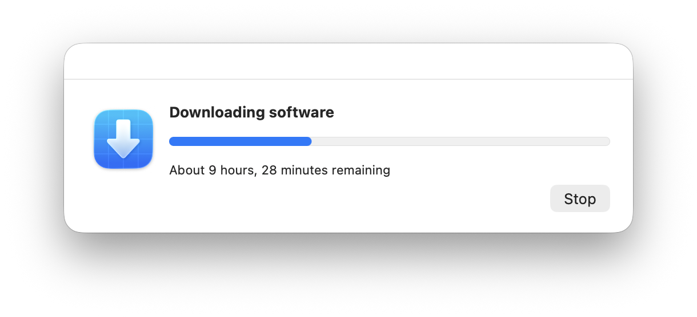

## Running Locally

### Start and Use PAMLA

After running `train.py` at least once, PAMLA can be initiated by running `predictive-ag-ml-assistant/scripts/start_pamla.py`.

> To stop the service, press `Ctrl+C`.

### OpenAPI Endpoint Documentation

Visit http://127.0.0.1:8000/docs to view the OpenAPI endpoint documentation (courtesy of our adoption of the FastAPI framework).

## Docker Deployment and Networking

### Build the Docker Image

This section will go over the process of building the Docker Image in case any source code modifications are needed to suit your specific purpose, environment, architecture, and so on.
> This project is intentionally verbosely documented as we expect diversity in candidate deployment environments, deployment purpose, available features, and data collection pipelines.
From the project root i.e., `(ag_env) user@host predictive-ag-ml-assistant % `:

1. With `llama.cpp` installed locally and Gemma 3 4B downloaded to `predictive-ag-ml-assistant/models/gemma-3-4b-it-q4_0.gguf`, **run**:

```bash
llama-server \
  -m models/gemma-3-4b-it-q4_0.gguf \
  --alias pamla-gemma \
  --ctx-size 4096 \
  --host 127.0.0.1 \
  --port 8080
```

The output should look something like:

```bash
0.00.174.828 I cmn  common_param: common_params_print_info: verbosity = 3 (adjust with the `-lv N` CLI arg)
0.00.177.011 W srv  llama_server: -----------------
0.00.177.012 W srv  llama_server: CORS is set to allow all origins ('*') and no API key is set
0.00.177.013 W srv  llama_server: this can be a security risk (cross-origin attacks)
0.00.177.013 W srv  llama_server: more info: https://github.com/ggml-org/llama.cpp/pull/25655
0.00.177.013 W srv  llama_server: -----------------
0.00.179.109 I srv    load_model: loading model 'models/gemma-3-4b-it-q4_0.gguf'
0.00.742.301 W load: control-looking token:    212 '</s>' was not control-type; this is probably a bug in the model. its type will be overridden
0.04.297.516 I cmn          init: llama threadpool init, n_threads = 4
0.05.048.763 I srv    load_model: initializing, n_slots = 4, n_ctx_slot = 4096, kv_unified = 'true'
0.05.061.379 I srv  llama_server: model loaded
0.05.061.399 I srv  llama_server: listening on http://127.0.0.1:8080
0.05.061.399 W srv  llama_server: NOTICE: server default port will be changed to :9931 in a future release
0.05.061.399 W srv  llama_server:         ref: https://github.com/ggml-org/llama.cpp/pull/26508
```

Naturally, things like CORS (Cross-Origins Resource Sharing) configuration warnings will vary between local runtime environments and browser versions/configurations. CPU worker thread pool initialization, the loading of our model, and of course, the model load and port subscription confirmations should be visible. Note that Gemma's 4,096 token context window -- specified by `n_ctx_slot` -- and the usage of port 8080 match the args supplied by our `llama-server` command.

2. Next, using the following command to `docker build` the Docker image using our Dockerfile (`predictive-ag-ml-assistant/Dockerfile`):

```bash
docker build -t pamla .
```

We will use `pamla` as our tag (specified by the `-t` flag).
> If you choose to modify the image, you may choose to rename it.

Upon completion, you should see a new **Docker Build** in Docker Desktop named `predictive-ag-ml-assistant`.
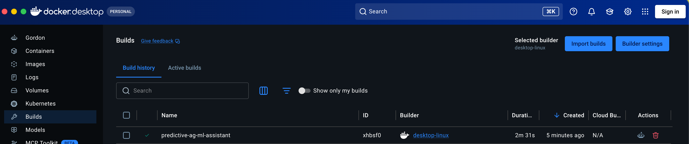

> If you prefer CLI validation, it should return:
> `View build details: docker-desktop://dashboard/build/<docker_context>/<docker_context>/<build_id>`
> You can copy that deep link URL and paste it into your browser to directly open Docker Desktop, if installed/available.

#### Dockerfile Summary

- **Python 3.11 slim base**, which saves approx. 750 MB from a full Python 3.11 build. Using `predictive-ag-ml-assistant/requirements.txt`, we will supplement the slim image with what we need directly, resulting an a more lean build.
- **Project-specific Python dependencies from `requirements.txt`** are installed, as previously mentioned.

The dependencies are as follows:

```txt
numpy==1.24.3
pandas==2.1.4
scikit-learn==1.3.2
tensorflow==2.15.0
matplotlib==3.7.5
seaborn==0.13.2
xgboost==3.2.0
keras==2.15.0
pyyaml==6.0.3
mlflow==2.22.5
protobuf==4.25.9
python-multipart==0.0.32
fastapi==0.141.1
uvicorn==0.53.0
pytest==9.1.1
httpx2==2.13.1
```

- **Creates /app as the work directory** using the `WORKDIR` command. If you need to inspect or modify the image, **/app** is the work directory used. In our code, file references relative to `PROJECT_ROOT` has been adhered to for best practices.

For example:

```python
@app.get("/", response_class=FileResponse, include_in_schema=False)
def home():
    """Serve the local PAMLA interface."""
    return FileResponse(PROJECT_ROOT / "src" / "static" / "index.html")
```

Points to the following file:

```
predictive-ag-ml-assistant/src/static/index.html
```

Which should be accessible in the Docker image through:

```Dockerfile
/app/src/static/index.html
```

- **Deployment-relevant folders are copied to the image.** Carrying off of our last point, the following folders are copied to the image:

```
COPY src/ src/
COPY configs/ configs/
COPY models/ models/
COPY data/ data/
```

If you have any resources or assets that are needed for deployment, ensure that the folder is copied or that the resources/assets are included in one of the aforementioned folders.

- **Port 8000 is noted as an exposed port, hinting at PAMLA's runtime web interface.** We will review the actual port binding in the default command section that follows this.

- **CMD states the default command.** By specifying 0.0.0.0, we allow uvicorn to listen on all network interfaces within the container. This command solidifies the exposition of the container's port 8000, where the runtime host's port 8000 is binded to the container's port 8000 during runtime.

```Dockerfile
CMD ["python", "-m", "uvicorn", "app:app", "--app-dir", "src", "--host", "0.0.0.0", "--port", "8000"]
```

### Run the Docker Container

Finally, run the Docker image that we built from the Dockerfile in the previous section using the following command:

```bash
docker run --rm \
  -p 8000:8000 \
  -e LLM_BASE_URL=http://host.docker.internal:8080/v1 \
  pamla
```

A successful run may appear as such:

```bash
INFO:     Started server process [1]
INFO:     Waiting for application startup.
INFO:     Application startup complete.
INFO:     Uvicorn running on http://0.0.0.0:8000 (Press CTRL+C to quit)
```

...Once complete, you may visit `localhost:8000` to interact with **PAMLA v1.0**.


There are some moving pieces in PAMLA. Between XGBoost's OpenMP dependency on Apple Silicon and documented Docker-derived DNS resolution hazards (we'll discuss that shortly in this section), it's best to test full functionality of PAMLA before assuming the presence of `index.html` means deployment was an easy success.

A couple of things happen when running this command:
**`docker run ... pamla`**. We specify that Docker is to run the Docker image we created in Step 2 (as we tagged the image `pamla` using the `-t` tag).

- **Docker starts a temporary container, exposing port 8000.** This allows us to interact with it on port 8000, where the web server lives. It also defines the behavior. If the container is exited or closed (or crashes), it is not respawned. Additionally, any data changes that occur within this container are not persisted. This should be considered for your purposes. Please reference Docker's documentation to customize this command to suit your preferences. With this command, post-runtime/EOL container cleanup is not necessary.
- **The `LLM_BASE_URL` environment variable is specified as `http://host.docker.internal:8080/v1`**. This constant tells our container -- running our `pamla` Docker image -- to connect to the **Gemma 3 4B LLM API** at port 8080 on the host machine.

> The host is designated by the `host.docker.internal` portion of the address; it is a special DNS name used by Docker to refer to the host machine that the container is running on during runtime. This allows a container to easily connect to services (such as APIs, databases, etc.) through ports during runtime, and is useful when the deployment architecture separates required functions from the container during runtime.

### Host and Container Networking

The host machine runs:

- **llama.cpp** and the **Gemma 3 4B LLM Model** run on the host machine.
- EXPOSES: 8080, 8000

The container hosts:

- **PAMLA** -- consisting of **FastAPI**, **XGBoost 3.2.0 -- Regressor Machine Learning Model**, **Python code**, etcetera.
- EXPOSES: 8000

But the behavior of these exposed ports are distinct.

- Host:
  - 8080: Open for business. Directs users to Gemma's LLM API Web UI.
  - 8000: Open for business. Directs users to the PAMLA container's port 8000.

- Container:
  - 8000: Open for business.

Conceptually:

```
 _________________    _________________
|   Alice's PC    |  |  Mallory's PC   |
|                 |  |                 |
|                 |  |                 |
|                 |  |                 |
| "Hi PAMLA...    |  | "Hi Gemma...    |
| Soil moisture?" |  |  how 2 b evil?" |
|_________________|  |_________________|
       |                   |
       |                   |
       |                   |
       |                   |
    [Browser]          [Browser]
       |                   | ______________________________________
       |                   ||                                      |
 ______|___________________||_____                                 |
|    [8000]              [8080]   |                                |
|      ||      Host        ||     |                                |
|      ||    MacBook       ||     |                                |
|      ||               [LLM API] |                                |
|      ||                         |                                |
|____[8000]_______________________|                                |
       ||                                                          |
       ||                                                          |
    [Port Bind]                                                    |
       ||                                                          |
 ______||______________________                                    |
|    [8000]                    |                                   |
|                              |                                   |
| app.py/call_gemma(prompt) -> |___[host.docker.internal:8080]_____|
|                              |
|            PAMLA             |
|       Docker Container       |
|______________________________|
```

### Linux Host Resolution

> **NOTE:** For Windows and macOS, Docker's DNS port binding works out of the box.
> **For Linux users, this port binding feature does not always work by default.**
> This is because on Windows and macOS, Docker runs on a lightweight virtual machine, where the DNS feature is readily available. But on Linux, Docker runs baremetal -- directly on the host with no virtualization layer in between.
> To fix this, run `docker run ...` with the `--add-host` flag and `host-gateway` value: `--add-host=host.docker.internal:host-gateway`.
> Otherwise, while both the PAMLA container and the `llama-server` may load flawlessly, and Gemma may be pleasantly conversational:
> - The Docker container won't be able to resolve DNS lookups for Gemma's port on the local host machine
> - PAMLA won't be able to resolve calls to Gemma
> - and therefore, `call_gemma(prompt)` will result in an error, breaking the conversational LLM interface for the application, leaving PAMLA with no voice and its `XGBoostRegressor` with no work.

Conceptually:

```
 _________________    _________________
|   Alice's PC    |  |  Mallory's PC   |
|                 |  |                 |
|                 |  |                 |
|                 |  |                 |
| "Hi PAMLA...    |  | "Hi Gemma...    |
| Soil moisture?" |  |  how 2 b evil?" |
|_________________|  |_________________|
       |                   |
       |                   |
       |                   |
       |                   |
    [Browser]          [Browser]
       |                   |
 ______|___________________|______ 
|    [8000]   Bob's PC   [8080]   |
|      ||                  ||     |
|      ||      Linux.      ||     |
|      ||               [LLM API] |
|      ||                         |
|____[8000]_______________________|
       ||
       ||
    [Port Bind]
       ||
 ______||______________________ 
|    [8000]                    |_______________________________________________
|                              |_<_<_<_<.<                                     |
| app.py/call_gemma(prompt) -> |>_>_>_>_> ^ ECONNREFUSED and NXDOMAIN Factory  |  <----- It was DNS this time
|                              |        |______________________________________|
|                              |
|            PAMLA             |
|       Docker Container       |
|______________________________|
```

### Local LLM Deployment Considerations

> **NOTE:** `llama-server` does not have built-in authentication. As we've mentioned, with a standard on a conventional network, anyone on the network with the host's IP address can visit `<host_ip>:8080` and interact with Gemma directly, bypassing the PAMLA interface. This carries some potential concerns, with varying relevance depending on your deployment environment:

- **Unlicensed/prohibited use**: Please review the Gemma Terms of Use: https://ai.google.dev/gemma/terms, as well as the Gemma Prohibited Use Policy: https://ai.google.dev/gemma/prohibited_use_policy
- Tenant/resident conduct within your dwelling/domicile/complex/living space, employee/professional conduct within your business/office space, user conduct within your wireless network, and so on. Naturally, these concerns remain valid for both intended and unintended constituents of those spaces. An unintended user on a network -- whether they obtained access by obtaining a password, being in proximity, or via more sophisticated methods like remote host execution exploitation, could -- with little additional effort -- gain access to the dashboard by visiting `<host_ip>:8080`, and potentially commence violation The Gemma ToS/PUP. As such, changing default ports and securing the infrastructure is necessitated by virtually every deployment environment, and the methods of securing said infrastructure can only be fully determined by consulting those legally responsible for said deployment environment.
- There are certainly advantages that come with locally hosting LLMs. Deploying this to a cluster of H100s with CUDA plumbing would differ from its deployment to a Mac Mini stack. Here, you can separate that logic without disassembling the entire project. Containers can be duplicated and orchestrated. Load balancers can be implemented. Horsepower can be delegated to and from the model easier, and processing infra can more easily be centralized for monitoring, observability, and deployment ops, or it could be decentralized for redundancy, based on how you configure it. You could even go as far as to swap out LLM engines with surprisingly little involvement, though some candidate engines would likely take more work than others. **But there are certainly risks that come with locally hosting LLMs.** You do lose the advantage of having SOC Center oversight from OpenAI, Anthropic, Google, Meta, Microsoft, and in some regions, governing entities. The security concern regarding LLMs is certainly real. You do have a responsibility stake when deploying LLMs. **Monitor activity, secure infrastructure, and ensure the tool is used responsibly.**

## Testing

PAMLA's project root directory contains a `tests/` folder with a number of unit tests. This section will define the included tests, provide instructional documentation on setup for test environment, as well as test execution.

Tests include but are not limited to:

- data preprocessing
- model ML model function
- the FastAPI web server interface, as well as several ASGI pipelines
- LLM extraction pipelines and required deterministic Python code
- other critical functions

> *Our test suite includes interface tests that require direct communication with the Gemma LLM engine. Please ensure that you have downloaded `llama-server` and `gemma-3-4b-it-q4_0.gguf`.*

Our unit tests introduce two dependencies: 

- `pytest 9.1.1`, the Python testing framework.
- `httpx2 2.13.1`, a `starlette.testclient` dependency, by way of FastAPI's `TestClient` class. This class is used for testing ASGI servers without the unnecessary mass of loading a full live instance. The Application layer of the ASGI server is loaded at the unit test, the unit is tested, and the instance is retired at the end of the test. As a result, you get a full-fledged application state without ravaging a single instance with rapid-fire tests, which can lead to issues like concurrent modifications and race conditions.

> Want a slimmer Docker image deployment? Remove these from `requirements.txt` before building your Docker image -- just make sure to re-add them if needed for testing. This will be optimized in future updates. Because the Dockerfile build is oriented towards deployment practicality, unit tests are not included in deployment. A testing image may be implemented in the future for streamlining testing.

### Run the Test Suite

To run the test suite, we will activate the LLM server, activate the `ag_env` virtual environment, and run the unit tests.

1. **Ensure that `llama-server` is running on your machine.** You should be able to run it from any shell where `llama-server` is available.

```bash
llama-server \
  -m models/gemma-3-4b-it-q4_0.gguf \
  --alias pamla-gemma \
  --ctx-size 4096 \
  --host 127.0.0.1 \
  --port 8080
```

> To verify availability, run `which llama-server`. In a clean setup where you've installed `llama-server` to the baremetal machine with no transient Python virtual environment associations, it is probably cleanest to launch `llama-server` in a new, clean terminal window, and not in a virtual environment.

2. **Ensure that you are in the `ag_env` virtual environment.** If not, activate the `ag_env` virtual environment:

```bash
conda activate ag_env
```

3. **Finally, run the test suite:**

```bash
pytest tests/ -v
```

All 11 tests should pass.

### The Test Suite

#### Preprocessing Tests

##### `test_add_hourly_rainfall_from_cumulative_total()`

Verifies that PAMLA correctly converts the Acurite weather station-provided **cumulative** rainfall counter into **hourly rainfall**.

The test also verifies that negative returns, such as those caused by a cumulative counter reset or data pipeline errors, are converted to 0, as opposed to being parsed as "negative rainfall", a non-sensical value for the feature.

##### `test_encode_wind_direction()`

Verifies that the Acurite weather station-provided **wind direction in degrees** data is converted into **sine** and **cosine** features through their radian relationship.

The test checks the following degrees:

- 0°
- 90°
- 180°
- 270° 

...and confirms that the original column is removed after encoding.

> While some features -- such as cumulative rainfall -- may pose less harm by staying, degrees is particularly messy; 359° and 0° are cardinally neighbors; however, when taken at their numeric face value, they are the lowest and highest possible values. This poses a legitimate feature interpretation issue for the model -- it is not simply a "redundant column". As a result, the removal is verified as well in the unit test.

##### `test_extend_dataframe_forward_fills_missing_values()`

This verifies PAMLA's fill/forward-fill behavior when new hypothetical observations are added to the dataset.

In the case that a new observation extracted from Gemma contains partial features, the explicitly stated features should be filled, while the missing features should be forward-filled*. For example, a stated soil moisture observation should be appended, while an absent temperature value should be forward-filled from the previous observation in the dataset. In other words, the "assume no news is persistence" philosophy that we've championed.

> \* with the exception of `rainfall` and `dew_point`, which will be addressed separately.

##### `test_preprocessing_helpers_do_not_modify_original_dataframe()`

Verifies that the helper functions used in `preprocess.py` do not modify the original data. 

We do this for a couple of reasons:

- **`SettingWithCopyWarning` avoidance**: assigning a DataFrame variable to a sliced larger DataFrame can result in potential cases where modifying the assigned variable results in changes to the original DataFrame; a *whodunnit* mystery that we certainly want to avoid at all costs.
- **Have a deep copy**: similar to the previous reason; not only do we not want to track down mysterious DataFrame modifications, but we want each DataFrame persisted as its own independent copy, not a reference to a portion of another live Dataframe.

#### Model Tests

##### `load_test_objects()`

This function tests the function that loads:

- project config
- the selected deployment XGBoost
- deployment metadata
- the processed dataset

##### `test_deployed_model_prediction_shape_and_type()`

Tests that the deployment `model` can take the `features` returned by `prepare_latest_features()`, generate a `prediction` with `model.predict(features)`, and asserts that said prediction is a 1D array with a finite (not infinity, negative infinity, NaN, etc.), floating-point value.

Essentially, *can we get from the latest feature preparation function to a floating-point value prediction of our target variable?* Functionally, a core-function test of our deployment model.

##### `test_deployed_model_meets_minimum_performance_threshold()`

Naturally following the test of our deployment model's ability to produce an output of the correct **shape**, we have the test of our deployment model's ability to produce an output of the correct **quality**. 

This function evalutes our best XGBoost's performance in prediction on the final timeseries dataset. 

**The test asserts that the deployed model maintains an R² greater than 0.50.**

#### Interface Tests

##### `test_interface_parses_valid_observation_values()`

Verifies that valid structured sensor measurements can be represented by PAMLA's Observation and LLMExtraction Pydantic models.

This test verifies data can traverse through the `data` > `Observation()` > `LLMExtraction()` pipeline and come out unchanged and unscathed. It is largely a test of PAMLA's Pydantic validation.

This block represents the function quite well:

```python
    extraction = LLMExtraction(
        status="ok",
        values=Observation(
            temperature=80,
            humidity=40,
            rainfall=0.5,
            wind_direction=270,
        ),
        clarification=None,
    )
```

As you can see, `Observation(data)` is passed as `values` to `LLMExtraction(status, values, clarification)`. 

On the other side, the unit test checks that the extracted values for temperature, humidity, rainfall, and wind direction match their respective values at definition.

> Please observe that that this function tests the `Observation` under the condition that Gemma successfully extracted the data with no required `clarification` and a status of `ok`. 
> 
> That is not a test weakness -- a good unit test should deliberately test atomic features of a function with clearly-defined assumptions and conditions. 
> 
> This is just to note that as Pydantic `BaseModel` subclasses evolve, as does the unit testing surface area.
> 
> If unit tests cover every `values`/`status`/`clarification` combination, then issues near that LLM extraction boundary can generally either be: 
> - easily identified with unit tests, or 
> - diagnosed at the other end of the layer boundary, like in LLM custom instructions.
> 
> Because the LLM-side of that boundary can be more difficult to test, advanced coverage on the deterministic side of that boundary can help in fault indication -- and eventually -- fault isolation.

##### `test_interface_rejects_invalid_sensor_values()`

This function verifies data validation in our `Observation` `BaseModel` subclass. Specifically, it verifies that Pydantic data validation rejects invalid data values, as defined by our variable parameters within the subclass.

Some data validation examples in `Observation` are:

- **Humidity** >= 0
- **Humidity** <= 100
- **rainfall** >= 0
- **wind_speed** >= 0
- **wind_direction** >= 0
- **wind_direction** < 360
- **light_level** >= 0
- **timestamp** is of type `AwareDatetime` to produce a UTC timestamp, which matches Home Assistant's export. This ensures data is accurate, and that functions like `sort_index()` properly maintain the user's hypothetical observations at the correct position in the timeseries.

This specific test asserts the rejection of a `humidity = 140` value.

##### `test_dew_point_from_temp_humidity()`

This test verifies that PAMLA's `calculate_dew_point_f(temperature_f, humidity)` function returns a sensible value when given a temperature and humidity value.

For more information on usage, see [Dew Point Validation](#dew-point-validation).

##### `test_observation_to_df_converts_rainfall_to_cumulative_total()`

Verifies PAMLA's translation of the user-facing, LLM-extracted **hourly rainfall** variable to the Acurite weather station's **cumulative rainfall** column in the dataset.

For example:

If the cumulative total in the dataset is **0.16** and the user provides a hypothetical hourly rainfall value of **0.50**, then the return should be **0.66**.

This test also asserts that the rainfall feature is not present in the original DataFrame, providing a leakage checkpoint.

#### LLM Engine Integration Test

##### `test_gemma_parses_fahrenheit_with_space()`

As a result of temperature parsing issues (see [Temperature Parsing Validation](#temperature-parsing-validation)), this test performs an audit of the path from:

`json{"question": "..."}` > `AskRequest` Pydantic `BaseModel` subclass > FastAPI `/ask` endpoint > ASGI application > `llama-server` is reachable > Gemma 3 4B LLM Engine

...and then back to PAMLA.

The test sends the `question` KV-pair in a JSON object to the `/ask` endpoint, which applies the `AskRequest` Pydantic validation. FastAPI `TestClient` -- a `starlette.testclient`-based test framework designed for ASGI testing without needing to run a full live instance of the server -- spins up an Application Layer-oriented instance of the API in-process.

Our test still requires Gemma-connectivity -- and therefore `llama-server`-connectivity though, so as a result `llama-server` must be running for this test to pass.

The question tested is:

```json
json={"question": "What if the temperature is 80 F?"}
```

The test also POSTs to `/scenario/reset`, an endpoint we have that resets the instance-state-level data state, allowing the user to restart their hypothetical future prediction trajectory. For this purpose, it's used to ensure a clean API-house at the beginning and end of the test.

> `client.post("/scenario/reset")` is likely not required at the beginning and end of the test, but for best practices we will do it to ensure a clean state.
>
> We also assert that we receive a `200 OK` response from each reset POST -- before we test Gemma, and after Gemma's results are asserted -- so that doubles as a health check-nudge both before and after running the full API > Gemma ingestion > Gemma regurgitation > API receipt pipeline. With the potential for environmental breakage between baremetal `llama-server` and PAMLA, that added verification is a useful confirmation.

### Temperature Parsing Validation

> *Inspired* `test_gemma_parses_fahrenheit_with_space()`

During user acceptance testing, PAMLA initially failed to interpret commonplace temperature abbreviation inputs such as 80 F, while 80°F and 80 degrees F succeeded. 

As you can see, specifying the temperature as `80 F` resulted in an error in interpreting sensor changes:

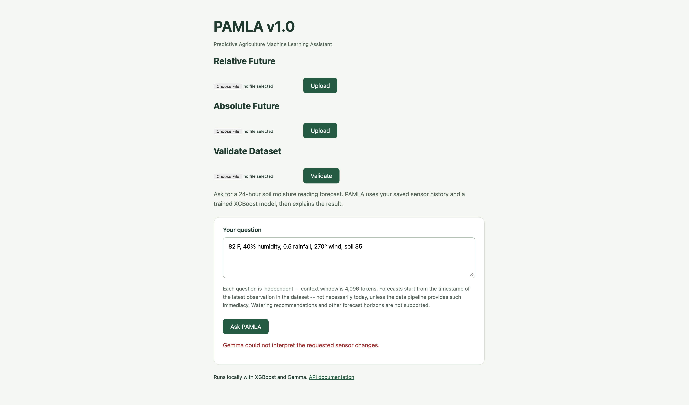

This was resolved by adding a section to Gemma's custom instructions prompt. 

```txt
Interpret common abbreviated units from context.

Examples:
- "80 F",
"80°F", and "80 degrees F" mean temperature=80.
- "70 percent humidity", "70% humidity", and "humidity 70" mean humidity=70.
- Cardinal wind directions should be converted to degrees: north=0, east=90, south=180, west=270.
- Return numeric values only; do not include unit strings in JSON
```

As a result, 80 F was correctly extracted to its apropos 80 degrees Fahrenheit temperature value.

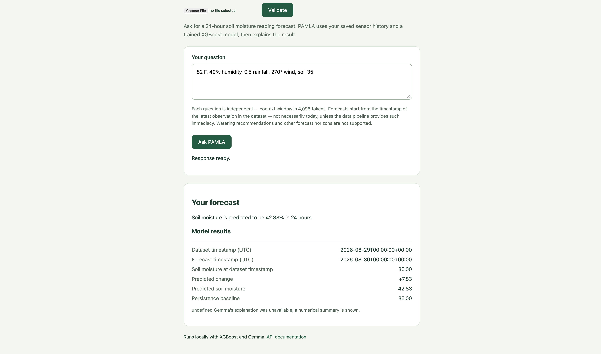

## Considerations and Limitations

### Sensor Environment and Drift

- The model is tuned to this specific sensor in this specific environment and position.
- Moving positions or changing sensors may prompt the need for retraining.
- For best results, monitor performance with drift detection.
- Changes in weather, seasons, climate, soil, noise, or other factors may skew performance.

### RF Security

- unencrypted 433 MHz data can be captured, spoofed, or used to locate and identify devices in the real world. This may lead to security concerns, especially if food is essential and the irrigation system is autonomous. For best results, physically secure the surrounding perimeter to reduce external RF Tx/Rx manipulation, use CV/humans to monitor qualitative plant health, and keep your WH51 sensor identifier private, as it can be used to identify your sensor location if signal is intercepted by an actor's RF receiver.

### Deployment Model Selection

> Please note that at this time, XGBoost is assigned as the selected model.
> In `train.py`: selected_model = xgb_delta_model
> While XGBoost performed overwhelmingly better than RandomForest and the MLP neural network in our experiments, the data pipeline evolution could change that.


##  Shortcut

### Overview
Thanks to PAMLA's LLM interface and well-defined schema, external API integrations can be surprisingly simple, given that:

- the output from the external service has a usefully compatible schema
- the output can be ingested by PAMLA's LLM Engine (Gemma 3 4B)

The Shortcut obtains the Weather Forecast at our dataset's impedance (Hourly). For each prediction in the Hourly Forecast from Apple, the data points relevant to our model's schema are extracted and put into a Text object. Then, each Text object representing an hourly observation is concatenated to one Combined Text. To ensure it is not overwritten and easily identifiable, the file is named using the timestamp, and the Shortcut asks the user where they would like to save the file.

### Download
The shortcut can be downloaded here:
https://www.icloud.com/shortcuts/d7c8257ee1594378802523f334925591

### Event Flow
Below is a screenshot of the event flow.
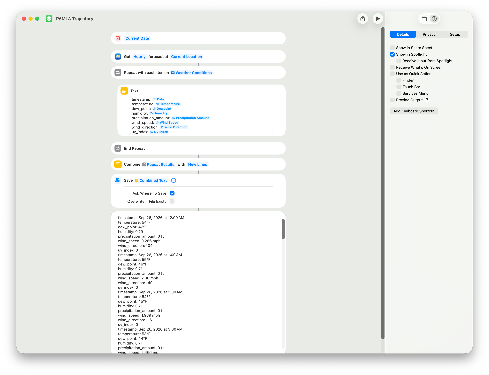

### Usage
To demonstrate usage, we've copied the first Hourly Forecast in the series of predictions and pasted it into PAMLA's text box.
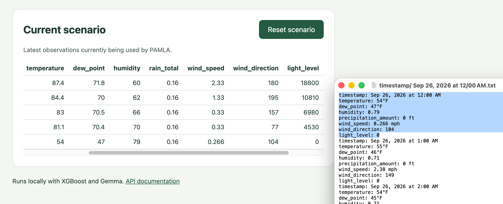
As you can see, between PAMLA's custom instructions for the LLM engine, the structure of the PAMLA Trajectory  Shortcut, and our Pydantic validation (using `Observation(BaseModel)` in `app.py`), PAMLA is able to successfully parse the output of the convenient automation. Apple's API returns humidity in a normalized range between 0 and 1, while our model takes a percentage between 0 and 100 percent. Our Pydantic validation requires humidity values to be greater than 0 and less than 100. In fact, this should likely be further defined as even Apple's normalized response would qualify. However, we've seen that the LLM engine was able to successfully make the conversion, with Apple's 0.79 humidity value being converted to 79 humidity in PAMLA's observation table.

## Future Work

### Watering and Environmental Features

- log manual watering in a **performative prediction**-conscious manner. See [*Reflection*](#reflection) section for more information.
- to address the performative prediction paradox, a new ML architecture direction must be selected. It can be as simple as adding a column to XGBoost (but asking more of the user at inference), or as complex as: adding an additional model, or using a Seq2Seq model with teacher enforcing.
- to select a new ML architecture, operational assumptions must be more explicitly defined. For example, certain architectures would require the user to provide (or the LLM to infer) human-initiated watering forecasts for the 24-hour period. This may rule out certain target audiences, while it would be perfectly suitable for others. Predictive agriculture is a vast field and, while the model has been demonstrated use cases in meteorology, scientific ecological conservation, and residential-scale horticulture, perhaps the definition of the project scope should be more explicitly enunciated. If it is to remain a Home Assistant companion specifically, that requires certain constraints for the target audience. If the project is to target large-scale environmental prediction, that requires certain constraints for the target audience. If the project is to remain ambiguous and focus on adaptability, certain compromises may need to be made. No single answer is correct. V1 defined certain domain-specific constraints, such as locally-hosted, stateful architecture. But from a conceptual perspective, if there are any non-negotiable functional or non-functional requirements to which PAMLA should adhere, those aspects should be considered *before* selecting a future ML architecture, as the future architecture choice may be a trajectorial hinge.
> For more information, please review the [*Reflection*](#reflection) section, which details the forecasting of the performative prediction feedback loop that would occur in a conventional deployment without architectural intervention. Perspectives such as the **Lucas Critique** are considered, and the architectural recommendations above are proposed in greater detail.
- implement sun/moon phase with complete historical data, determining what sun data can actually add new value
- research sine vs. cosine weather trends for wind direction as they relate to this specific geographical region
- rolling temperature, humidity, light, wind/rain exposure, atmospheric pressure, time-since-rain/watering, etc. Broader feature engineering with features we currently have -- especially lag features -- as we have rolling average enrichment bias that favors only the target column. The feature importance dominance of rolling soil moisture lag averages suggests that temporal trajectory and momentum may be a lucrative opportunity space.

### Data Collection and Sensor Reliability

- Because PAMLA makes predictions from the timestamp of the most recent observation, any delay in the pipeline of data capture > cleaning > model training > production becomes immediately imposed upon the experience of the end-user. As such, any improvements that can be made before Home Assistant persists and exports the data would help tremendously. For example, unrelated 433 MHz devices that are intercepted by the RTL-SDR antenna and converted to virtual devices could be pre-filtered or blacklisted unless approved. Virtual devices/dataset columns with large portions of unknown/unavailable/sentinel values should likely be ignored unless explicitly approved as the negative impact that a few questionable data points may have on the already high-resolution dataset is likely not "worth the squeeze"; especially since our current model is operating at a 1 sample per hour sample rate. Even dramatic increases in sample rate would still leave the suspected sentinel value "strays" to be considered relatively insignificant. Therefore, a conservative pipeline philosophy that favors confidence over resolution may be adopted in regards to infrastructure decisions.
- Implement `sensor.fineoffset_wh51_`<sensor_id>`_integrity_check` to self-heal, anomaly-detect, or exit with failure with Evidently after cyclic redundancy check failure mode
- Implement sensor battery voltage as a feature; standalone, it is beneficial for unit testing assertions (to validate rows); with enough variance in the data, it may be valuable for the model if it can perform sensor calibration
- perform an experiment to see if fluctuations in soil sensor boost may be used to assist the model in sensor calibration and anomaly detection (using the non-diagnostic prediction model as a baseline)
- ensure proper persistence of all dropped features so that they can be used in development
- attempt to achieve weather station-level resolution with the WH51 moisture reading, monitor potential sensor dropouts
- generally ensure persistence and aggregation of virtual sensors to prevent migration obstacles
- Since we kept the rainfall sensor in its raw form and observed the counter being reset, a next iteration should address this as it can lead to confusion due to the arbitrary change in position.

### Model Selection
- V2: dynamically select best performing model (instead of selected_model = xgb_delta_model)

## Reflection
While observations, conclusions, and recognitions of opportunity for improvement has been scattered amongst `exploration.ipynb` and this README, a proper section containing key dissenting opinions was deemed necessary.

First and foremost, this project started with merely the idea that Home Assistant could act as a useful data source as it pertains to telemetry of an existing soil moisture sensor and weather station. Throughout `exploration.ipynb`, previously unknown persistence policies and the evolution/devolution of data resolution produced the realization that the project may not be possible, given the timeline of delivery. Data refinement was unusually intense and we ended up with just over three months worth of data after starting with data that seemingly spanned about eight months. At a point, one must wonder if the surviving features at the end of the notebook would be sufficient, and if the downsampling of the dataset to its least common temporal factor would sabotage eventual predictive capacity of a trained model. Even the soil moisture sensor itself initially seemed to be less resolute than the weather station until the trendline was visualized and imputation was strategized. 

During initial training, to be candid -- the models initially performed laughably bad. The Multi-layer Perceptron (MLP) model consistently performed the worst, while initial speculation saw potential. Across the board, performance was worse than even the worst metrics currently show, and the baseline model seemed eons ahead of what could possibly be produced given the dataset and resources. After observing the results of early training, the plausibility of the project was considered. The methodological process was reviewed for gaps and shortcomings. Among the identified gaps were: **the temporal evolution of season change** that our collection period endured, and an **additive, human-initiated volumetric water source that was undocumented due to a lack of instrumentation in the data collection process**. 

To address the temporal evolution of season change, chronological 5-fold cross-validation with a 24-hour purge gap was implemented to ensure the training and testing sets had access to temporal diversity to help equalize the observed sampling bias. This resulted in considerable gains nearly across the board (the MLP model still performed laughably bad). At this point, a cautious sense of optimism was restored. Performance gains were acquired that suggested our methodology may have helped overcome at least a portion of the performance setbacks. After observing performance sustain and even rise in testing, it was concluded that there could be additional unknown hinderances that could be resolved through a scientific approach; and at the same time, we were forced to recognize that attempting to predict this domain space is quite literally braving the elements. The field of predictive agriculture with machine learning can be quite challenging, and meteorology is renowned for having multiple models for environmental forecast prediction (such as hurricane prediction models) that sometimes shine, and sometimes are ruled out early in the lifecycle of the predicted entity. With this in mind, we recognized the environmental variables and global diversity that can lead to mixed results, and that our season change-based dataset for this specific region may have had turbulence that would require a meteorologist to identify. Additionally, our project intentionally set to predict soil moisture at a 24-hour prediction horizon. At a time, a shorter prediction horizon was entertained. To experiment, the model was in fact tested on a 12-hour prediction horizon. As you might expect, this led to performance increases that were not negligible -- it was quite considerable. Yet, we opted to maintain our 24-hour prediction horizon. Why? First of all, it changed the question and the experiment. While some variables may change in model usage, it was decided that the bar of the 24-hour prediction horizon should stay static. It purposefully allows us to distance acute variables from maintaining dominance over long-term trajectories and maintain performative consistency. For example, a model that factors in acute conditions and trends more heavily may perform exceptionally well during periods of rain, but less so during clear weather. As a result, the model becomes conditionally reliable. The intention of this experiment was -- and should remain to be -- to predict soil moisture in a timeseries dataset using long-term hyperlocal environmental data. A model that can tell you what you already know from looking out the window has much less predictive capacity. But as a result, we have set an intentionally high bar. The 24-hour time horizon allows us to ask a very important question -- without knowing tomorrow's weather, what will the soil moisture be at the end of the day tomorrow? In other words, we are trying to predict the conditions of the Earth tomorrow without factoring in the weather tomorrow. That bar may need revision for maximum predictive capacity, but the question is certainly not one on which we should give up. It sets a bar that is difficult but worthwhile.

Another reason we certainly should not give up on the question is that the unmeasured additive source of water was left as a loose end. While the possibility of engineering a sort of proxy feature to hint at human-initiated water addition was momentarily considered, it was decided that it would not be a sound approach as it would require assumptions to be made that could not be scientifically proven. As a result, the data processing pipeline was refined to the extent appropriate while leaving room for improvement in a future version. After all, while some implementations of this project would recognize human-initiated water metrics as a captive, integral instrument in the pipeline, other implementations of the project -- such as observing the ecological evolution of soil in its natural state -- may treat the source as noise. Nevertheless, it is a data point. So, how should this be treated? While both use cases have a value for the human-initiated water column, a model trained on purely environmental data certainly has its use -- after all, **if the model predicts that humans will water the plant consistently when the soil moisture reaches a certain value, would it not begin to predict that the human-initiated water itself is inevitable, and factor that into prediction?** 

If a human has a plant that they value enough to use PAMLA to maintain its health, they would almost certainly water the plant reliably within its discrete, ideal moisture bounds. For example, ginger's optimal soil moisture is between 60% and 70% soil moisture. If PAMLA predicts that the soil moisture value will drop **below** 60% in 24 hours, **then the human will almost certainly water the plant within the next 24 hours.** In deployment, this can result in the phenomenon **performative prediction** -- a **prediction-induced feedback loop** -- which occurs **when a machine learning model's forecast changes the real-world outcome it tries to predict**. There are documented examples of this phenomenon. If a GPS app predicts heavy traffic on a road and reroutes users to a different route, then the GPS route's reroute can unintentionally *create* heavy traffic on the alternate route. Famously, Microsoft researcher **Rich Caruana** has discussed a case study in which researchers developing a healthcare ML prediction model experienced the same phenomenon. Researchers training a pneumonia risk model found that **asthma appeared to reduce the risk of dying from pneumonia**. While it appeared true in the historical data (and essentially was), the relationship was that **asthma patients were treated as high-risk** by conventional process, resulting in faster, more expedited care (like ICU admission, which often resulted in more aggressive care). As a result, the model learned the *effect* of asthma care, but treated that effect as a property of asthma itself.

Applying the concept to our model, if the user reliably waters the plant when the moisture hits near 60%, the model would identify the relationship and begin to expect and predict the behavior of the user. In a deployment environment where human-initiated irrigation may occur, said irrigation may act as a confounder, due to the confounding by intervention (irrigation?) effect.

Specifically in the case of soil moisture, the feedback loop can result in an interesting phenomenon. **Imagine that PAMLA recognizes that soil rebounds at 60% soil moisture.** The user begins to rely on PAMLA's prediction. PAMLA predicts that soil will rebound, because *it always does* when soil moisture hits 60% moisture. As a result, **PAMLA predicts that the soil moisture will be 65% in 24 hours, since it expects the human to water the plant when soil moisture gets to 60%, which it projects will occur**. As a result, the relationship falls apart. The user notices the ginger plant begin to dry and wilt. **The user retrains PAMLA on new data from the last few days, which does not contain the paradoxical relationship.** PAMLA now understands that 60% does not imply a rebound. **PAMLA successfully predicts that soil will continue to descent past 60% soil moisture.** PAMLA now predicts the soil moisture accurately. The user begins watering the soil again. After ingesting data, **the model recognizes that soil naturally rebounds at 60% moisture, and once again fails in prediction of low moisture values.** This cyclical construction and de-construction of the relationship between PAMLA and the user is analogous to the **Lucas Critique** -- posited by economist Robert Lucas Jr. in 1976 -- which states that **it is a mistake to try and predict the civic response of a new policy based entirely on historical data, as people alter their behavior when rules change.** But in this case, the prediction of human behavior is not the primary focus -- it is an underlying assumption made by PAMLA. PAMLA posits that humans have behaved in a certain way, and based on that assumption, provides a projection. Eventually, PAMLA realizes that 60% rebounds. Instead of acting in accordance with the old policy of 60% descends, PAMLA decides to change its behavior. PAMLA now states that 60% rebounds, expecting humans to continue to water the plant and *create* the reality that PAMLA predicted would occur. If the events continue to play out in this manner, the relationship will invariably fall apart in accordance with **Lucas' Critique**. Ironically, PAMLA's projection would have been true had it not changed the policy and expected the same behavior to continue. As a result of the human <> PAMLA co-dependency, **the more successful the model is at recognizing human involvement in soil moisture, the less reliable it becomes in prediction at the critical boundary where human involvement occurs.** 

One may argue that its prediction becomes *so reliable* that it recognizes the trajectory, makes the assumption that the human will intervene, then provides a projection with that assumption included. PAMLA may have correctly predicted that humans would provide input, but that was only true under the circumstance that PAMLA provide the value that PAMLA would have provided **without** the knowledge of that observation, which is where the prediction fell short. As a result, the outcome is sabotaged, leading to a paradoxical relationship where the two cannot co-dependently maintain the plant. And in our experiment, we have a 24-hour prediction horizon. That window may become a liability with performative prediction. The probability that the human would naturally water the plant within a 24-hour period would likely be quite high as it *approaches* the minimum soil moisture boundary. That probability would increasingly rise hour-over-hour, day-over-day as it descents below the boundary. In other words, in the days where model reliability would be needed the most, the probability of human involvement would increase, leading to a decrease in the reliability of the model. 

> **NOTE**: In our V1 model experiment, **the performative prediction feedback loop did not occur in our dataset.** As PAMLA had not yet existed, the data collection period did not measure a period in which PAMLA was predicting soil moisture for the user. Therefore, the feedback loop did not occur. The architectural issue was caught in V1's *Reflection*, identifying the feedback loop before it could manifest. **Therefore, the prediction paradox was predicted before it could exist, and as such, cannot be used to explain existing predictive performance deficiencies.** Nevertheless, V1 exploration was required to surface the human-initiated data collection gap, which in turn surfaced the future prediction paradox. As a result, the collection gap can be addressed in V2.

As a result, we have a paradoxical relationship to untangle. What are common methodologies used to dislodge yourself from downward R2 gravity when you've walked into the **performative prediction**-**Lucas Critique** pitfall in a noisy, complex domain? How do you deal with branched realities stemming from both the output of your model and the reliable un-reliability of human nature? Three distinct opportunities have been identified, and they will be listed:
- **Exogenous input architecture**: This is perhaps the most natural for our implementation. We've brushed on its essence throughout this project. In addition to our current environmental data and soil moisture, we introduce an **exogenous variable** -- that is, an external action input variable. For many rows in the time series, the value is zero. When human-initiated watering occurs, the value is documented during that observation period (e.g., 500 mL of water added at 10-02-2026 02:00 PM). This simply allows the model to be aware of when human-initiated watering occurs. The catch is that **at inference, an estimate for the exogenous variable must be provided.** That is not a concern for us -- in our domain, we could both reliably determine when human-initiated watering would occur, create a manual irrigation logging/automatic irrigation pipeline, and be able to provide a forecast of how much watering is estimated to occur during a hypothetical observation at inference. That expectation is not unreasonable for many deployments. Perhaps ESP-32-based smart watering cannisters and peristaltic valves could assist in data collection. However, when the 24-hour prediction is forecasted, **the exogenous variable must provide a hypothetical future schedule for manual watering.** This more than merely asking the user, "How much water will be added in the next 24 hours?", or "How much water will you add this hour?". This would require a schedule. If the user couldn't reliably provide *when* the plant will be watered, the predictive capability of the model would be impacted. **At a point, placing model reliability on human-provided forecasting may both: ask too much of the user, and diminish the value of the model's environmental inference potential by bottlenecking it with human-provided estimates if the deployment environment is unpredictable.**
- **Sequence-to-Sequence (Seq2Seq) with Target Forcing.** With an encoder-decoder network, an **encoder** can specialize in environmental variables, while a **decoder** takes a proposed hypothetical future (regarding manual watering) to to output future moisture, detaching the environmental model from the human prediction model.
- **A model-duality approach.** Here, there are two models: a model trained purely on **environmental data** (with no manual watering) and a model trained on **all data** (with watering events). With a human-behavior model, the environmental model can be contextualized.

We've known for some time during this project that an **exogenous input variable** for human-initiated watering is required. As early as `exploration.ipynb`, we've noted the need for collecting this datapoint. Ultimately, **all three architectures require the use of an exogenous variable.** Therefore, **the evolution of PAMLA can go in at least three different directions; each a different architecture path**.

Before we can answer the architecture question, there's a more philosophical, deeper question at the core: **What are the operating assumptions?** 
- **The project originally started as an augmentation to a static Home Assistant automation, which sends a notification when the soil moisture reaches a certain value.** For the purpose of the ginger plant -- even with an intuitive LLM interface -- **how much can a ML API ask of the user before becoming *less* acceptable than a standalone static automation?** This is not to denounce the project concept. On the contrary, the idea is to genuinely define the non-functional requirement boundary that PAMLA should stay within. If asking for 24-hour watering estimates is too much for a dwelling with multiple residents, then the architecture will veer in a distinct direction.
- **Is PAMLA targeted to be a Home Assistant add-on itself, or will the deployment environment change?** If the project stays in the Home Assistant ecosystem specifically, the audience and use case may change. If the project is oriented towards agricultural deployments, the residential front-end considerations may carry less weight.
- **Is the value in ecological pattern prediction, or plant pot-scoped cultivation?** We've discussed the project from both sides of this spectrum, genuinely. We've discussed how it pertains to residential use and how it is related to hurricane tracking through wind patterns. There is certainly overlap, and both count as predictive agriculture with different assumptions. But the requirements and direction of the two use cases are distinct. **It is possible for the project to try to remain adaptable.**

Ultimately, the result of PAMLA V1 is that we now have **a functional, conversational prediction engine with a tangible front-end interface, a fully-realized, domain-driven philosophical pillar of locally-hosted architecture, a stateful design approach that enables LLM context window minimization, a conservative request body, and runtime-long, long-term user engagement sessions that the core functionality drives**. With the general architecture and design principles fleshed out by V1, we can see the deployment requirements take form. A requirement for locally-hosted architecture leads to certain computational requirements. Certain computational requirements make its use as a Home Assistant plugin that runs on someone's Raspberry Pi 5 unrealistic. Therefore, a completed PAMLA V1 gives us some non-negotiable specifications needed to answer the question, "**what are our operating requirements?**". **Perhaps the performative prediction paradox could not have been solved until the minimum specification project was built**. 

*In other words...*

 Sorry to answer one paradox with another, but the performative prediction paradox may itself require deployment before its solution can be properly specified. As a result, **an R2 of approx. 0.56 itself is deemed sufficient** for PAMLA V1 -- the first instance of the larger project vision -- as **completing the prototypical design and architecture** is **required** to answer the question of how the performative prediction paradox ***can*** be addressed. 